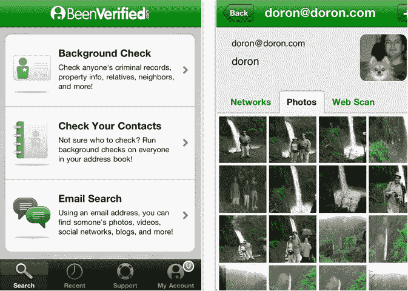

# BeenVerified 使用新的 Android 应用程序和 iOS Rerelease 进行背景调查 TechCrunch

> 原文：<https://web.archive.org/web/http://techcrunch.com/2011/06/29/beenverified-takes-background-checks-mobile-with-a-new-android-app-and-an-ios-rerelease/?utm_source=feedburner&utm_medium=feed&utm_campaign=Feed%3A+Techcrunch+(TechCrunch>&utm_content=Google+Reader)

 背景调查现已完全移动化，这要感谢[已被验证](https://web.archive.org/web/20230203065635/http://www.beenverified.com/)的安卓新[应用和 iOS](https://web.archive.org/web/20230203065635/https://market.android.com/details?id=com.beenverified.android&feature=search_result) 应用的[重新发布。背景调查应用程序的功能与你预期的完全一样:它从 BeenVerified 的网站上提取数据，并允许你通过姓名查询或电子邮件地址来调查你认识的人。用户只需点击一下，就可以查看他们的联系人，让你看到你隔壁隔间的人被逮捕了多少次。幸运的是，我没有不良记录，否则我不会写这个。对吧，被证实了？](https://web.archive.org/web/20230203065635/http://itunes.apple.com/us/app/background-check-app/id342585873?mt=8)

当背景调查应用程序在 2009 年首次推出时，它在不到一个月的时间里被下载了近百万次。由于这种积极的下载(以及一些关于隐私问题的问题)，苹果实际上在几周后就从其应用商店中撤下了该应用。但是，本月，在与苹果进行了长时间的对话后，BeenVerified 能够缓解苹果的担忧，并在他们的支持下重新发布了这款应用。在最初的四天里，这款应用的下载量超过了 14K 次。

正如 Reputation.com 的 Michael Fertik 告诉 TechCrunch 的 Andrew Keen 所说，隐私问题正在成为“网络经济中的下一件大事”，人们现在比以往任何时候都更愿意为在线服务付费，以阻止 cookies 并保护他们在网络上的声誉。随着社交媒体变得无处不在，网络激增，难怪我们对隐私的看法正在被彻底改变。一些人会说“受到威胁”，而另一些人会认为这是我们数字进化的自然组成部分。

不管你在这个问题上的立场如何，至少可以说，网络上的许多信息都是可疑的，人们仍然希望知道那些与他们做生意、约会或交往的人是值得信任的，不会做出有害的事情。社交网络正以闪电般的速度向前发展，随着 Airbnb、Match、Craiglist 和无数其他服务的出现，虚拟世界和现实世界之间的差距正在缩小。由于这种情况，对我们在网上遇到的第三方客观公共记录信息的需求呈指数增长，特别是在一些情况下，比如说，我们在 Airbnb 上把公寓租给了谁，我们希望这些信息可以随时随地访问。

因此，BeenVerified 的使命是让背景调查变得容易——更重要的是，负担得起——这就是为什么该应用程序可以免费下载，每个用户每月都可以获得一次免费的背景调查，包括犯罪记录、年龄和地址历史。然而，不幸的是，它并不都是免费的。如果用户每月想要一份以上的报告，可以通过应用内支付购买额外的支票，每次 9.95 美元。

虽然 BeenVerified 已经提供了超过 1000 万次免费背景调查，并通过其移动和网络应用程序 [NumberGuru](https://web.archive.org/web/20230203065635/http://itunes.apple.com/us/app/number-guru-reverse-phone/id431750800?mt=8) 提供无限制的免费反向电话查询，但对于个人信息的访问权限和普及程度，肯定存在一些问题。我真的可以在美国搜索任何人并获取他们的背景信息吗？

不完全是。BeenVerified 通信主管 Danny Canarick 告诉我，大多数犯罪记录都是在县一级存储和维护的，但正如人们可能想象的那样，并非美国所有 3100 多个县都提供了数字版本的记录。这就是为什么该公司开始了“法庭跑步者”服务，收取少量费用，指导一名真实的法庭跑步者去当地法院提取记录的实际硬拷贝，并创建一次性的数字版本。虽然这项服务目前只能通过 BeenVerified 网站获得，但 Canarick 表示，该公司计划在不久的将来将其引入手机。

目前，该公司的应用程序可以数字化访问 46 个州的刑事定罪，以及 35 个州部分地区的逮捕令数据。这些数据直接来自法院行政办公室、公共安全部、教养部等。

最后，对于 TechCrunch 的读者来说，在接下来的七天里，所有应用内的背景调查都将以 99 美分的价格提供。所以，读者们，看看背景调查应用程序，让我们知道你的想法。

更多信息，请查看下面的视频:

[vimeo = http://vimeo . com/25792637 width = " 620 " height = " 380 "]