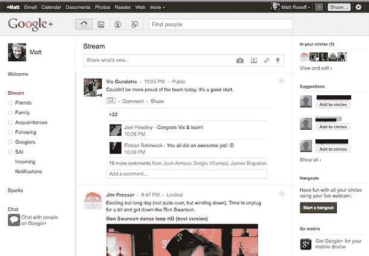
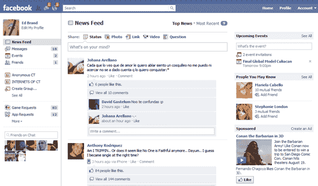
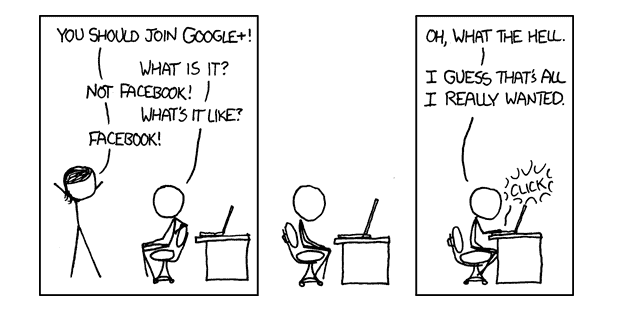

# Google+界面是否让你想起了脸书？你不是唯一一个 TechCrunch

> 原文：<https://web.archive.org/web/https://techcrunch.com/2011/06/29/does-the-google-interface-remind-you-of-facebook-youre-not-the-only-one/>

# Google+界面是否让你想起了脸书？你不是唯一一个

毫无疑问: [Google+](https://web.archive.org/web/20230123003703/https://plus.google.com/) 真正的[看起来不错](https://web.archive.org/web/20230123003703/https://techcrunch.com/2011/06/28/google-plus-design-andy-hertzfeld/)。但是，正如成千上万的人已经注意到[和开玩笑说的那样，它也确实](https://web.archive.org/web/20230123003703/http://www.businessinsider.com/wow-google-looks-exactly-like-facebook-2011-6)[看起来很像](https://web.archive.org/web/20230123003703/http://www.timesunion.com/business/article/Google-Plus-looks-a-lot-like-Facebook-1444698.php)[脸书](https://web.archive.org/web/20230123003703/http://www.crunchbase.com/company/facebook)。

UX 设计师兼顾问 [UXboy](https://web.archive.org/web/20230123003703/http://uxboy.com/) [同意](https://web.archive.org/web/20230123003703/http://twitter.com/#!/uxboy/status/86013983802408960)的观点，并把两个界面[并排放在一起](https://web.archive.org/web/20230123003703/http://twitpic.com/5iiwos/full)来展示两个服务的入口页面是多么的相似。

自己判断:

**更新**–来自 [xkcd](https://web.archive.org/web/20230123003703/http://xkcd.com/918/) :

