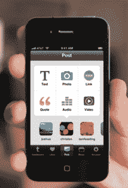

# 使用全新的 Tumblr iPhone 应用 TechCrunch 获取帖子

> 原文：<https://web.archive.org/web/http://techcrunch.com/2011/06/29/get-posting-with-gorgeous-new-tumblr-iphone-app/>

# 使用全新的 Tumblr iPhone 应用程序发布帖子

如果你是 Tumblr 国家的一员，而且越来越多的 T2 人也是，那么你会想下载 Tumblr 的新的 iPhone 应用程序 T4，它是经过全新设计的，有一个新的界面。它会加载你的 Tumblr 仪表板流，但 post 按钮会为每种帖子类型显示六个简单的图标:文本、照片、链接、引用、音频和视频。当然，你可以直接用手机上传照片或视频。

新功能包括支持多个 Tumblogs、风景编辑、回复消息和保存草稿。它还可以访问你手机上的通讯录，帮助你在 Tumblr 上找到其他可以关注的人。新用户可以直接从手机应用程序注册。

它看起来很华丽，是一个功能齐全的移动博客应用程序(带照片共享！).我也喜欢录音功能，用你手机的麦克风来录音。你还能要求什么？

Tumblr 博客的更多细节。