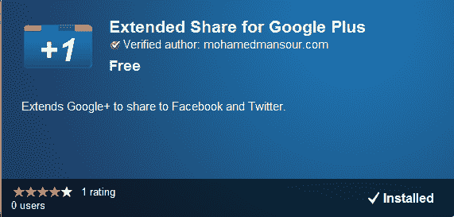

# 这很快:Chrome Extension 为 Google+TechCrunch 添加了脸书、Twitter 分享功能

> 原文：<https://web.archive.org/web/https://techcrunch.com/2011/06/29/that-was-quick-chrome-extension-adds-facebook-twitter-sharing-to-google/>

# 这很快:Chrome Extension 为 Google+增加了脸书、推特分享功能

今天早上我还在[和](https://web.archive.org/web/20230203075956/https://techcrunch.com/2011/06/29/google-plus-is-actually-pretty-good/)[谷歌+](https://web.archive.org/web/20230203075956/https://techcrunch.com/2011/06/28/google-plus/) (以及整洁的[移动网络应用](https://web.archive.org/web/20230203075956/https://techcrunch.com/2011/06/28/google-plus-iphone-web-app/))一起在玩，到目前为止，我认为它有一些潜力([不是每个人都同意](https://web.archive.org/web/20230203075956/https://techcrunch.com/2011/06/28/google-wrong-question-social/))。

但是像我这样的人倾向于使用不止一个社交网络服务，所以我很高兴看到有人已经开发了一个 Chrome 扩展，可以让 Google+用户向脸书和 Twitter 推送帖子。它有时会有一点小问题，但总的来说，它像宣传的那样工作。

它的功能是在 Google+帖子中添加一个“发送至”选项，允许你转贴任何出现在你的脸书和推特个人资料中的内容。

我对它的主要不满是，有时你需要点击刷新才能看到链接。

当然，你需要是 Google+用户才能看到分享的帖子；请注意，该项目目前仍处于[【现场试验】](https://web.archive.org/web/20230203075956/http://googleblog.blogspot.com/2011/06/introducing-google-project-real-life.html)阶段，仅接受邀请。

开发人员 Mohamed Mansour 表示，在未来，这一扩展将使人们能够在 Twitter 和脸书 sans 对话框上即时分享 Google+的帖子(或许还有更多社交网络)。顺便说一下，源代码可以在 GitHub 上找到。

