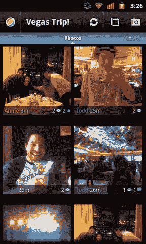
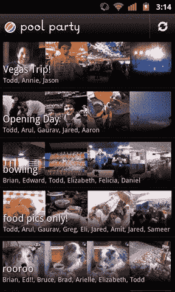

# 泳池派对:谷歌也有自己的秘密照片分享应用——由 Slide TechCrunch 开发

> 原文：<https://web.archive.org/web/https://techcrunch.com/2011/06/30/google-slide-pool-party/>

# 泳池派对:谷歌也有自己的秘密照片分享应用——由 Slide 开发

回到三月份，我们[第一次曝光了](https://web.archive.org/web/20230205013758/https://techcrunch.com/2011/03/25/disco-app/) [Disco](https://web.archive.org/web/20230205013758/http://disco.com/) ，这是谷歌内部的 Slide 团队打造的一款[群组消息应用](https://web.archive.org/web/20230205013758/https://techcrunch.com/2011/05/23/google-disco-2/)。这还不是他们工作的全部。向[泳池派对](https://web.archive.org/web/20230205013758/http://www.poolpartyapp.com/)问好，这是谷歌内部同一个团队的另一个秘密项目。

我们对泳池派对知之甚少，只知道它是 Slide 团队开发的一款照片分享应用。据说重点是创建实时显示新照片的群组相册(“池”)。

该应用程序目前正在接受邀请测试。谷歌也能为其获得 poolpartyapp.com 域名——虽然不像 disco.com 那么吸引人，但也够了。

最有趣的是，Slide 正在谷歌内部开发这些新应用，而谷歌的其他团队也在从事类似的项目。例如， [Google+的特点是](https://web.archive.org/web/20230205013758/https://techcrunch.com/2011/06/28/google-plus/)既有群发消息组件(Huddle)又有移动照片分享组件(Instant Upload)。当我问 Google+的负责人维克·冈多特拉和布拉德利·霍洛维茨，他们为什么不在 Google+中使用迪斯科，他们都笑着说他们不知道我在说什么。

据信，Slide 被允许在谷歌内部自主开发他们自己的项目，这两个应用似乎都很好地证明了这一点。问题是谷歌是否以及何时会利用自己的影响力来推广这些东西。Disco 已经是第二版了，还没有谷歌的推广。

可悲的是，与脸书的秘密照片应用程序不同，我们只能获得两张泳池派对的照片。享受吧。

**更新**:布罗迪·邓肯[在推特上写道](https://web.archive.org/web/20230205013758/https://twitter.com/brodie_duncan/status/86574974588026881)，[看看安卓市场已经有了什么](https://web.archive.org/web/20230205013758/https://market.android.com/details?id=com.slide.poolparty)——安装了 0 个！还不清楚你是否能以这种方式使用泳池派对，因为这是在私人测试版中，但是可以下载！

**更新 2** :看看这个，[也在应用商店里](https://web.archive.org/web/20230205013758/http://itunes.apple.com/us/app/pool-party/id435829813?mt=8)！我们之前认为这将是安卓独有的，但显然不是这样。

 