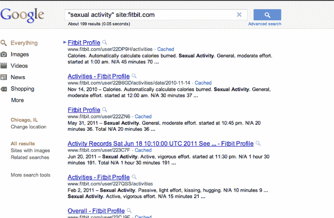

# Fitbit 追踪的性活动出现在谷歌搜索结果中 TechCrunch

> 原文：<https://web.archive.org/web/http://techcrunch.com/2011/07/03/sexual-activity-tracked-by-fitbit-shows-up-in-google-search-results/?utm_source=feedburner&utm_medium=feed&utm_campaign=Feed%3A+Techcrunch+(TechCrunch>&utm_content=Bloglines)

# Fitbit 追踪的性活动出现在谷歌搜索结果中

呀呀。健身和卡路里追踪器 [Fitbit](https://web.archive.org/web/20230203032918/http://www.fitbit.com/) 的用户在网站上创建个人资料时可能需要更加小心。该公司的追踪器和在线平台的许多用户的性活动可以在谷歌搜索结果中找到，这意味着这些用户的档案是公开的，可以搜索到。您可以点击[这里](https://web.archive.org/web/20230203032918/http://www.google.com/search?q=%22sexual+activity%22+site:fitbit.com)访问这些结果。下一张网[今天早上早些时候报道了这个](https://web.archive.org/web/20230203032918/http://thenextweb.com/industry/2011/07/03/fitbit-users-are-inadvertently-sharing-details-of-their-sex-lives-with-the-world/)。

你可能知道，Fitbit 追踪器是一种紧凑型可穿戴设备，可以夹在衣服上或放入口袋中，并通过加速度计技术捕捉日常健康活动的信息，如行走的步数、行走的距离、燃烧的卡路里、运动强度和睡眠质量。用户还可以在网站上记录营养、体重、额外活动(包括性活动)和其他健康信息，以便获得他们健康的完整图片。

那么，为什么 Fitbit 用户的个人资料能够在谷歌中被搜索到呢？这真的不是 Fitbit 的错。创建个人资料时，默认隐私设置允许在搜索结果(Google、Bing 等)中找到个人资料。如果您不取消选中此设置，显然会使您的个人资料公开，任何人都可以找到。

因此，这些用户在记录他们的性活动以计算他们在给定时间内燃烧了多少卡路里时，可能会无意中分享他们最亲密的细节(即亲吻、拥抱等)。

当然，性确实算作锻炼，但在把它记录在 Fitbit 上并公开你的个人资料之前，你可能要三思而行(TMI，有人吗？).为了缓解这个问题，也许 Fitbit 应该改变它的隐私默认值。

感谢安迪·拜奥的提示。

