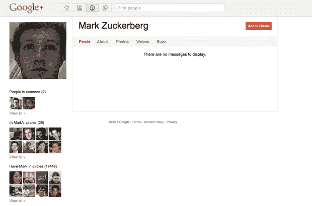

# 扎克伯格感到惊讶的是，人们对他在 Google+TechCrunch 上感到惊讶

> 原文：<https://web.archive.org/web/http://techcrunch.com/2011/07/03/zuckerberg-surprised-that-people-are-surprised-hes-on-google/>

# 扎克伯格惊讶于人们对他在 Google+上感到惊讶

脸书首席执行官马克·扎克伯格[加入 Google+](https://web.archive.org/web/20230204121105/http://news.google.com/news/story?hl=en&q=Google%2B+Mark+Zuckerberg&bav=on.2,or.r_gc.r_pw.&biw=1196&bih=690&um=1&ie=UTF-8&ncl=dAV9diIH7n1FCfM9JKaSTHKRTYaJM&ei=nvAQTuX8DpD2swOe8vitDg&sa=X&oi=news_result&ct=more-results&resnum=1&ved=0CCgQqgIwAA) 是在一个大型媒体活动上，从 *[【福布斯】](https://web.archive.org/web/20230204121105/http://blogs.forbes.com/kashmirhill/2011/06/30/mark-zuckerberg-is-on-google-but-he-doesnt-look-happy-about-it/)* 到 *[《每日邮报》](https://web.archive.org/web/20230204121105/http://www.dailymail.co.uk/sciencetech/article-2009944/Google-Plus-Facebook-founder-Mark-Zuckerberg-appears-rival-social-network.html)* 的每个人都报道了这位创始人建立 Google+个人资料的事实，建立了包括前 Facebook 人[达斯汀·莫斯科维茨](https://web.archive.org/web/20230204121105/http://www.crunchbase.com/person/dustin-moskovitz)和现任脸书首席技术官[布雷特·泰勒的圈子。](https://web.archive.org/web/20230204121105/http://www.crunchbase.com/person/bret-taylor)

当许多人怀疑真正的扎克伯格会加入一个竞争性的社交服务时，科技博客作者罗伯特·斯科博发短信给扎克伯格本人证实了这一点。扎克伯格刚刚回我短信了。说“为什么人们对我有一个谷歌账户感到如此惊讶？"

如果有人仍然怀疑这是真正的扎克伯格，Scoble 告诉我，当扎克伯格提到谷歌账户时，他确实指的是谷歌+账户。但真正的问题是，为什么*对扎克伯格选择使用 Google+感到如此惊讶？*

也许答案就在谷歌创始人拉里·佩奇和谢尔盖·布林的先例中，他们似乎回避以自己的身份在脸书互动。(根据史蒂文·利维的说法，布林[实际上是脸书](https://web.archive.org/web/20230204121105/http://www.wired.com/epicenter/2011/06/inside-google-plus-social/all/1)的笔名。谷歌董事长 Eric Schmidt 也是传闻中的在服务中，独立于迈克[模仿他的时候](https://web.archive.org/web/20230204121105/https://techcrunch.com/2010/10/10/being-eric-schmidt-on-facebook/)。

抛开佩奇和布林的行为不谈，许多其他创始人(比如 Myspace 的汤姆和 T9)已经表明，分享和享受竞争性服务是完全正常的，不应该被认为是间谍行为。我个人只希望扎克伯格在 Google+上比在 Twitter 上更高产。

https://twitter.com/#!/Scobleizer/status/87321128783192064