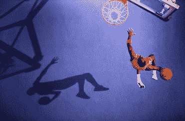

# 明星对优秀团队 TechCrunch

> 原文：<https://web.archive.org/web/http://techcrunch.com/2011/07/04/stars-versus-great-teams/?utm_source=feedburner&utm_medium=feed&utm_campaign=Feed:+Techcrunch+(TechCrunch>)

在硅谷，明星员工的价值是普通员工的 10 到 100 倍，这是不言而喻的。这种计算对于软件工程师来说尤其如此，但也适用于产品经理、销售主管和其他关键员工。如果你是一名明星，科技公司愿意吸引或留住你的可能性是无限的。

我们一次又一次地看到这种情况。脸书以 5000 万美元收购 Friendfeed，只是为了得到其才华横溢的工程师(联合创始人 Bret Taylor 现在是脸书的首席技术官)。去年，谷歌向一名员工工程师开出了 350 万美元的还价，以阻止他去脸书。今年，它向两位顶级产品经理支付了高达 1 . 5 亿美元的薪酬，以阻止他们去 Twitter。

雇佣明星，他们不仅会比其他人更努力，还会提升整个公司的业绩。我在科技和媒体公司都目睹了这种情况。明星们加入进来，提高了门槛，结果其他人也拿起了他们的游戏(或者出于骄傲或者恐惧，或者两者兼而有之)。

但不是每个人都能成为明星。有时候，当它们离开最初成为恒星的环境时，它们会褪色。哈佛商学院的一项研究曾经观察过华尔街的明星分析师，并得出结论，当他们跳槽时，他们的表现并没有那么好。进一步的研究表明，明星成功跳槽的一些因素包括新公司在文化和资源方面与旧公司的相似程度，以及明星带领团队的能力。

这些研究都没有着眼于科技初创公司的动态。他们更关注华尔街或大公司，在那里明星的定义是不同的。然而，*快速公司*的联合创始人比尔·泰勒最近在[的博客上发表了一篇博文](https://web.archive.org/web/20230205003946/http://blogs.hbr.org/taylor/2011/06/great_people_are_overrated.html)，试图将这一观点应用到硅谷，他说人们高估了伟大的人。泰勒举出波士顿布鲁因斯队和达拉斯小牛队作为反例，说明伟大的球队可以比拥有明星球员的对手做得更好。

几周前，当我转发这篇文章时，Square 首席运营官的基思·拉布瓦几乎立刻回应道:“他错了。”哦，是的，我问，布鲁因斯怎么样？对此拉布瓦回答道:

http://twitter.com/#!/rabo is/status/83570556460470273

想象一下，如果你可以招聘所有人，并给他们提供几乎无限的股票上涨空间——这就是热门创业公司的招聘方式。像拉博伊斯这样的人每次雇人时都在兜售梦想。如果他们曾经实现过这个梦想，或者能够展示出如此大的吸引力，让最优秀的员工很难拒绝他们，那会有所帮助。因为谁不想要无限的上升空间呢？

那么，归根结底是招聘公司本身是否是明星。明星球员都想去明星公司工作。初创公司可以雇佣多少明星没有限制，尤其是如果它主要以股票支付薪酬的话。

但这并不意味着明星不需要团队精神。最优秀的明星带领着身边的人。他们激励、鼓舞并以身作则。他们也尽可能地帮助他们的队友，因为他们知道他们不能独自做所有的事情。

雇佣明星和雇佣一个伟大的团队是错误的选择。你应该总是试着雇佣你能找到的最好的人:那些明星或者有潜力成为明星的人。尤其是在科技创业公司，明星会吸引其他明星，因为最聪明的人希望与其他聪明人一起工作。雇佣平庸的球员是创建平庸公司最可靠的方法。

最好的明星是那些能与其他人一起工作，并提升整个组织的人。一个充满明星的公司最终会让明星们相互补充，形成一个伟大的、有凝聚力的团队。他们通过弥补彼此之间的不足来隐藏彼此的弱点，就像一支伟大的篮球队总是在任何时候把球传给处于最强位置的人。

一家公司有太多的明星也会造成竞争，从而拖垮公司。但是那些人不再是明星。公司是一项团队运动。如果你的球队很烂，你就成不了明星。

*图片来源:Flickr/ [cliff1066](https://web.archive.org/web/20230205003946/http://www.flickr.com/photos/nostri-imago/4439636726/)*