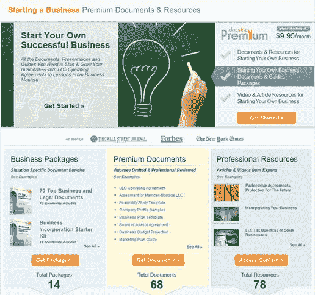

# DocStoc 翻开了新的一页，因为它看起来是小企业知识的一站式商店 TechCrunch

> 原文：<https://web.archive.org/web/https://techcrunch.com/2011/07/05/docstoc-turns-a-page-as-it-looks-to-be-a-one-stop-shop-for-small-business-knowledge/>

# DocStoc 翻开了新的一页，因为它看起来是小企业知识的一站式商店

多年来，我们一直在跟踪[位于洛杉矶](https://web.archive.org/web/20221209173438/https://beta.techcrunch.com/tag/docstoc/)的初创公司 [DocStoc](https://web.archive.org/web/20221209173438/http://www.docstoc.com/) ，从该公司作为一个与 [Scribd](https://web.archive.org/web/20221209173438/http://www.scribd.com/) 直接竞争的相当广泛的文档共享网站的根基，到最近，它成为一个更专门为企业服务的中心，提供[捆绑](https://web.archive.org/web/20221209173438/https://beta.techcrunch.com/2010/02/23/docstoc-debuts-marketplace-for-professional-documents/)的优质专业文档供购买。今天，该公司在这个方向上又迈出了一步，对网站进行了重新命名，其口号是“我们让每个小企业都更好”。

那么这到底意味着什么呢？

首席执行官 Jason Nazar 解释说，去年该公司一直在建立一个专业文档库，他们有 2000 万个用户上传的文档，并计划在年底前再有 10，000 个内部编写的文档(或外包给签约的专业人员)。Nazar 说，这种 DocStoc 制作的内容的目标是为企业提供一套文档，包括招聘表格、时间表和法律文件，他们可以相信这些文档是高质量的，因此他们不必费力地阅读类似文档的多个版本。这些内容可以通过付费订阅服务获得，每月 20 美元(如果你一次购买几个月，价格会下降)。

除了创建自己的文档，DocStoc 还越来越多地制作与创业和运营相关的文章和视频。纳扎尔说，这仅仅是开始。今年晚些时候，该公司将推出更多产品来帮助简化业务管理(就文件而言)，包括一个帮助快速完成表格的向导。几个月来，DocStoc 一直在提供其中的一些功能，Nazar 表示，这家初创公司已经有“数万”家公司注册订阅。

我对这项服务的不满是:DocStoc 包括免责声明，称它不提供法律建议，因此如果你以错误的方式使用文件，或者没有使用正确的文件，或者其他任何事情，它都不负责任。Nazar 表示，该网站的大多数专业文件都与法律问题无关，对于那些相关的问题，该网站还将帮助用户与咨询服务联系，因此如果你想确保你的业务以正确的方式发展，你可以与某人交谈(付费)。如果您已经知道自己在做什么，那么 DocStoc 可能正是您正在寻找的。

该公司上次融资 400 万美元是在 2008 年，现在已经盈利，有 35 名全职员工。纳扎尔说，在过去的三年里，收入每年都翻一番。