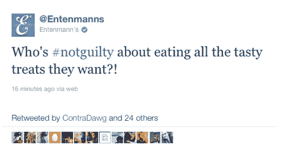

# Entenmann 的标签冲浪以#无罪推文| TechCrunch 失败告终

> 原文：<https://web.archive.org/web/https://techcrunch.com/2011/07/05/entenmanns-hashtag-surfing-fails-hard-with-notguilty-tweet/>

# 恩滕曼的标签“冲浪”以#无罪推文失败告终

Twitter 现在几乎爆发了 140 个字符的愤怒，反对凯西·安东尼[“无罪”](https://web.archive.org/web/20230326142512/http://www.reuters.com/article/2011/07/05/us-crime-anthony-idUSTRE7620Y720110705)谋杀案判决的不公正。像往常一样，烘焙食品制造商 Entenmann's 的一些社交媒体专家犯了一个与热门话题相关的严重错误。

取决于你相信什么， [@Entenmann 的](https://web.archive.org/web/20230326142512/http://www.twitter.com/entenmanns)的声音要么认为在热门#无罪标签上冲浪很有趣，要么真诚地不看，只是在一条关于吃美味的推文中随机贴上一条#无罪，大概是为了获得关注。

这当然事与愿违。在追随者的强烈反对下，恩滕曼删除了这条推文，并道歉说，“对不起大家，我们并没有试图在我们的推文中提到审判！我们应该先查看热门话题标签，然后跟进“我们的#无罪推文是不敏感的，尽管完全是无意的。我们真诚地感到抱歉。”

哦，标签冲浪的危险！虽然该公司自己表示，与凯西·安东尼审判的联系是无意的，但我很难相信有人会在没有先看标签引用了什么的情况下，就在推特上发布包括热门标签在内的东西。

无论如何，看起来 Entenmann's 已经提高了社交媒体愚蠢的门槛，从[前#赢家](https://web.archive.org/web/20230326142512/https://techcrunch.com/2011/02/03/kenneth-cold/) @KennethCole 手中夺走了奖杯。品牌的关键要点:一些热门话题不能轻易在推特上发布。

**更新:**当然，现在有了一个 [@EntenmannsPR](https://web.archive.org/web/20230326142512/https://twitter.com/#!/EntenmannsPR) 恶搞推特账号。

https://twitter.com/#!/enten Mann s/status/88330014629699585

https://twitter.com/#!/enten Mann s/status/88339172213014528