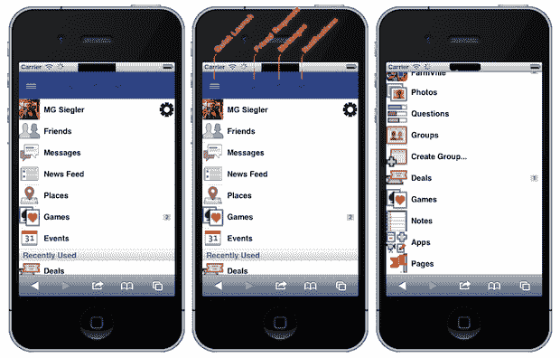

# 在一场脸书活动的前夕，斯巴达人准备迎接另一场 TechCrunch

> 原文：<https://web.archive.org/web/http://techcrunch.com/2011/07/05/facebook-spartan-ipad-html5/>

明天早上，在他们位于帕洛阿尔托的总部，脸书将举办一场活动，展示一款“[棒极了的](https://web.archive.org/web/20230209125057/https://techcrunch.com/2011/07/01/facebook-to-hold-news-event-next-wednesday-for-awesome-launch/)新产品。我们的消息来源告诉我们，该产品将是传闻已久的 Skype 在脸书的集成，用于全面的视频聊天——就在一周前，宿敌谷歌公布了 Hangouts 作为 Google+ 的一部分。鉴于消息已经泄露，脸书很有可能会惊喜地谈论他们的 iPad 应用程序或新照片体验。但是有一件事不在议程上，那就是斯巴达计划。

你会记得 [Project Spartan](https://web.archive.org/web/20230209125057/https://techcrunch.com/2011/06/15/facebook-project-spartan/) 是一个 HTML5 驱动的移动应用平台，脸书在一群第三方应用开发者的帮助下已经悄悄构建了几个月。虽然其中一些开发者认为脸书的意图是打破苹果(和谷歌)对移动应用领域的控制，但当我们报道时，脸书开始抓狂了。旋转几乎立即开始。这种情况一直在持续，甚至在第三方开发团队参与项目时也是如此——他们被亲切地称为“斯巴达人”。

我们之前报道过，在我们最初的故事之后，脸书开始联系斯巴达人，提醒他们该项目的信息是保密的(同时告诉媒体这种东西真的“没什么新的”)。从那以后，脸书也加强了他们的比赛。我们现在听说已经和斯巴达进行了很多严厉的谈判，告诉他们这个项目不是为了追赶苹果。但它并没有真正发挥作用。“我看着这些应用程序，它们的内容是多么丰富，它们与苹果毫无关系，却与脸书有着千丝万缕的联系，我以为他们认为我们是弱智，”一个人这样说道。

一名开发者表示，该平台上的应用质量确实令人惊讶——当然是以一种好的方式。显然，将会有大量的游戏成为斯巴达的一部分。这不应该太令人惊讶，HTML5 游戏一直是脸书推动的事情。据信，Zynga 将大力参与该项目。

那么 Spartan 什么时候推出呢？脸书正努力让每个人在 7 月 15 日之前做好准备。一位消息人士预计，正式发布会将在 8 月 1 日之前。

虽然我们一直不愿意提供这个项目的许多截图，因为它可能会泄露源代码，但我们已经确保了下面的一个略有改动。你会注意到它看起来像是当前脸书移动网站的修改版。当然，你在当前的移动网站上找不到的两样东西就摆在你面前:游戏和应用程序——还有通知！

顶部的蓝色条被称为“chrome”(是的，它与谷歌的一款产品同名)。开发者表示，这是将所有不同的移动网站结合在一起的粘合剂。这是一个关键——这些 HTML5 应用据说驻留在其他地方，而不是在脸书自己的服务器上(至少现在是这样)。因此，他们不得不通过外部调用来引入脸书的“chrome ”,以使这些应用看起来像真正的脸书应用。

为了更好地了解这是如何工作的，请查看由马特·凯利创建的[这个“入门”网站](https://web.archive.org/web/20230209125057/http://www.mattwkelly.com/html5/getting-started/)，马特·凯利是脸书的一名工程师，他与开发人员一起工作。毫无疑问，这个网站将被拉，但它本质上显示了如何在第三方网站上建立基于 HTML 的导航。它看起来很好，而且很快。它还谈到了一些事情，例如使用远程呼叫在移动网络应用程序中发送行动警报——“这可以用于重新参与，就像告诉朋友该轮到他们玩棋盘游戏了。”

同样值得注意的是我们得到的指向[这一页](https://web.archive.org/web/20230209125057/http://connect.beta.facebook.net/en_US/all.js)的单独提示。显然，脸书 Javascript SDK 在过去一周经历了一些大的变化，包括大量引用 FB。原生、iOS 和 Android。一名开发人员注意到，本机代码似乎主要与方向有关，并怀疑这是否与 iPad 应用程序有关。还有一堆“mweb”(移动网络)的代码，这显然是一个新参数，允许来自脸书平台的应用程序自动登录(是的，斯巴达应用程序)。

之前，我们推测 Project Spartan 和 iPad 应用程序的发布可能有关联。事实上，我们听说脸书和苹果甚至在一些事情上合作，至少是松散的合作。虽然 Spartan 的最终目标显然是让 HTML5 占上风，但有可能苹果只是不相信它会很快实现，并且很乐意帮助脸书尝试一下，同时也帮助网络从总体上超越 Flash(想想如果没有那些需要 Flash 的游戏，Flash 会处于什么位置)。

一位开发人员指出:

> 脸书想要从苹果的移动应用市场分一杯羹，这一点一直以来都很明显。也许这不是对苹果的战争——也许苹果只是将他们的市场份额(HTML5 份额)赠送给脸书，作为交换，一个联盟正在形成，苹果由此获得脸书 6 亿多用户的一些独家访问权，从而排挤谷歌(在某种程度上是独家的，脸书对它来说太开放了，不能完全独家)。在这个理论中，这不是脸书斯巴达 vs 苹果，而是脸书/苹果斯巴达 Vs 谷歌。

斯巴达人被告知要专门为 iOS 版 Safari 编写代码——包括 iPhone 和 iPad。

事实是，很难知道脸书在这一点上的确切意图——现在太多的事情似乎都在变化，在一系列泄漏事件后，脸书对他们的卡非常保密。当然，HTML5 的角度将被渲染为“开放”，而不是针对苹果或谷歌。但更大的现实仍然是:脸书希望这个 HTML5 应用平台取得成功，这样移动世界就不会完全被这两家公司控制。他们希望自己的信用平台能够主导移动领域。脸书现在必须表现得友好，说正确的话，因为他们还没有自己的手机——T2。

说到这里，这里没有太多，但我们听说脸书电话项目的工作仍在继续。有传言称他们正与三星密切合作。另一家公司也让他们与 Pivotal Labs 合作。脸书当然会否认知道这件事。但是只需要一个快速的理性思考就能意识到，未来脸书需要控制两样东西来维持权力:一个网络浏览器和一部手机。想到他们*不会*两个都做才是真正疯狂的。

这些都不能说明脸书正在进行的其他大项目，比如他们的音乐发布会。这很可能是他们的下一次 f8，我们最后一次听说是在八月底。是的，[它将涉及许多合作伙伴](https://web.archive.org/web/20230209125057/http://gigaom.com/2011/06/19/revealed-facebook%E2%80%99s-music-plans-involve-spotify-others/)。

对脸书来说，这个夏天将会是非常激动人心的一年。明天开始。

*【感谢[汤姆](https://web.archive.org/web/20230209125057/http://www.cutoutandkeep.net/)——需要澄清的是，不是斯巴达的消息来源，是上面一些其他信息的线人】*

