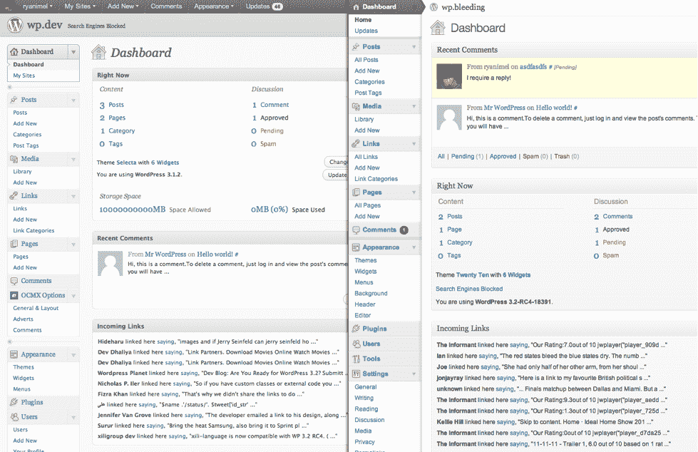
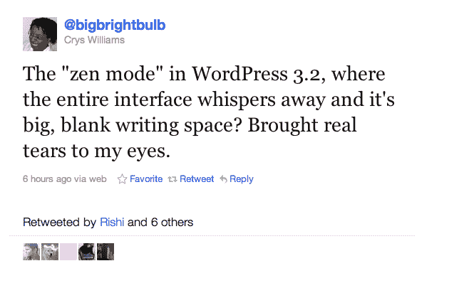

# WordPress 3.2 放归野外；24 小时内下载超过 33 万次 TechCrunch

> 原文：<https://web.archive.org/web/http://techcrunch.com/2011/07/05/wordpress-3-2-released-into-the-wild-downloaded-more-than-330k-times-in-24-hours/>

# WordPress 3.2 放归野外；24 小时内下载超过 33 万次

 [ WordPress 3.1 不到 5 个月下载量超 1500 万次](https://web.archive.org/web/20230206214140/https://techcrunch.com/2011/07/04/wordpress-3-1-downloaded-15-million-times-in-under-5-months/)。但是时间在前进，音乐也在前进。昨天， [WordPress 3.2](https://web.archive.org/web/20230206214140/http://wpcandy.com/reports/wordpress-3-2-is-now-available) ，又名“Gershwin”，向公众发布，短短 24 小时内，网站和博客平台的最新迭代已被下载超过 33 万次。他们现在长得很快。

为什么这么多人下载最新迭代？[根据马特·莫楞威格和公司](https://web.archive.org/web/20230206214140/http://wpcandy.com/presents/everything-we-know-about-wordpress-3-2)的说法， [WordPress 3.2](https://web.archive.org/web/20230206214140/http://wpcandy.com/reports/wordpress-3-2-is-now-available) 的目标是“更轻更快”，这意味着格什温在删除额外代码、重写某些查询以优化速度等方面发挥了作用。

用户界面在新版本中也做了一些调整，你可以从下面 3.1(左)和 3.2 版本的对比中看到:

3.2 版本的另一个很酷的功能是 WordPress 所说的“不受干扰的写作”(DFW)，它取代了“全屏”模式，用一种新的模式让仪表板在用户写作时淡出背景，以提供一种不那么混乱的观看体验。该团队也将此称为“禅模式”，显然用户感受到了禅的力量:

根据 Mullenweg 的说法，除了试图让整个 WordPress 体验更快，并对管理设计进行一些调整，该团队还更新了默认主题，以兼容微博、HTML5 和任何屏幕尺寸。所有急需的改进。(为了完全公开，TechCrunch 运行在 WordPress 上。)

这是 WordPress 的第 15 个主要版本，网站平台现在拥有超过 15，000 个插件。更重要的是，WordPress 3.2 将无法与 Internet Explorer 6 兼容，这一点微软[似乎对](https://web.archive.org/web/20230206214140/http://wpcandy.com/reports/microsoft-thanks-wordpress-for-dropping-ie6)很满意。

WordPress 的贡献者现在也将在一个“信用屏幕”中获得信用，因此最终信用可能会在信用到期时给予，特别是对于所有那些参与了 15 个 WordPress 迭代和计数的开源开发的人。

关于格什温所有新更新的完整摘要，[点击这里](https://web.archive.org/web/20230206214140/http://wpcandy.com/presents/everything-we-know-about-wordpress-3-2)查看。