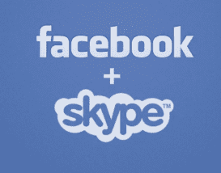

# 脸书推出 Skype 视频通话技术

> 原文：<https://web.archive.org/web/https://techcrunch.com/2011/07/06/facebook-launches-skype-powered-video-calling/>

证实我们上周[的报道](https://web.archive.org/web/20230205044547/https://techcrunch.com/2011/07/01/facebook-will-launch-in-browser-video-chat-next-week-in-partnership-with-skype/)，脸书刚刚宣布了一项与 Skype 同步推出的重要新功能:视频通话。

这是一个已经流传了很久的功能，也是脸书非常重视的一个功能。现在，每当你浏览朋友的个人资料时，你会看到一个新按钮，位于“消息”和“戳”按钮之间，上面写着“通话”。点击这个按钮，其他用户会看到一个弹出窗口，询问他们是否要接听电话，然后你会立即连接上(第一次使用这项服务时，你需要安装一个小插件)。

你还会看到视频通话集成到脸书的聊天产品中。真的，你不能错过它——脸书今天推出了一个新的聊天侧边栏，默认情况下，它占据了屏幕的整个右侧，当你第一次点击任何用户时，你都会看到一个提示，询问你是否想进行第一次视频通话。如果您尝试发起视频通话，而其他用户没有响应，系统会提示您向他们发送视频信息。

那么，为什么这是一件大事呢？脸书强调了这样一个事实，即用户不必创建新的 Skype 帐户来打电话，这将允许用户以非常少的设置来呼叫他们的朋友和家人(安装小程序的流程只需要几秒钟)。

当然，这是在 Google+推出一周后发生的，Google+包括一个名为“Hangouts”的视频聊天功能。脸书的视频聊天还不支持群组聊天，但当被问及脸书是否会推出群组视频通话时，扎克伯格表示不排除任何可能性。他补充说，一对一通话占视频通话的绝大部分。

Skype 首席执行官托尼·贝茨上台发表了一些评论。他提到了一件重要的事情:Skype 正在和脸书讨论通过网络形式提供一些付费产品。

**更新:**工程师 Philip Su 刚刚发表了一些关于团队如何构建该功能的[笔记](https://web.archive.org/web/20230205044547/https://www.facebook.com/notes/philip-su/building-video-calling/10150229123673920)。

他写道，脸书根据你使用的浏览器使用不同的技术来安装 Skype 插件，以帮助简化体验:

> 每个浏览器和操作系统的安装流程
> 为了使安装尽可能简单，我们专门为每个操作系统和浏览器组合定制了安装流程。例如，在启用了 Java 的 Mac 浏览器上，安装程序完全托管在浏览器中，因此不需要额外的点击。我们在 Windows 浏览器中使用一个小的 bootstrap EXE 来最小化初始下载时间，并尽可能无缝地管理安装权限。我们还将整个安装流程嵌入到功能本身中，而不是需要单独的下载和安装页面，这样一旦安装完成，您的呼叫就会自动继续。

同样非常酷的是:脸书用户匿名使用 Skype 的服务。

> 保护用户身份
> 为了确保您无需单独的 Skype 帐户就能拨打电话，脸书使用加密的用户 id 连接到 Skype 的安全 REST APIs 以设置必要的凭证。这为以前可能从未使用过 Skype 的用户提供了视频通话的可能性，并使所有人的整体通话体验更加简单。虽然直接向 Skype 提供用户 id 会更容易，但我们还是竭尽全力确保用户在 Skype 服务上得到保护和匿名。

*加更。*