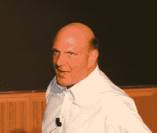

# 微软首席执行官史蒂夫·鲍尔默将在 2012 年 CES 上发表主题演讲 TechCrunch

> 原文：<https://web.archive.org/web/http://techcrunch.com/2011/07/06/microsoft-ceo-steve-ballmer-to-keynote-ces-2012/>

# 微软首席执行官史蒂夫·鲍尔默将在 2012 年 CES 上发表主题演讲

[微软](https://web.archive.org/web/20230203123616/http://www.crunchbase.com/company/microsoft)掌门人[史蒂夫·鲍尔默](https://web.archive.org/web/20230203123616/http://www.crunchbase.com/person/steve-ballmer)将[重返【2012 年 1 月的](https://web.archive.org/web/20230203123616/http://www.businesswire.com/news/home/20110706005393/en/Microsoft-CEO-Steve-Ballmer-Deliver-Preshow-Keynote) [CES](https://web.archive.org/web/20230203123616/http://cesweb.org/) ，以一场预展主题演讲拉开消费者技术贸易展的序幕，这是他第四次登上这个舞台。

“我们很高兴欢迎微软重返 ces 主题演讲舞台，”拥有并制作 CES 的消费电子协会(CEA)总裁兼首席执行官加里·夏皮罗(Gary Shapiro)表示。

2012 年国际消费电子展定于 2012 年 1 月 10 日至 13 日在内华达州拉斯维加斯举行。CEA 表示，2012 年国际消费电子展主题演讲的完整阵容将在未来几个月公布。

鲍尔默的主题演讲定于 1 月 9 日周一下午 6:30 在威尼斯人酒店举行。

微软在[年](https://web.archive.org/web/20230203123616/http://www.crunchgear.com/2010/01/06/live-from-the-ces-2010-keynote-with-steve-ballmer/)年[年](https://web.archive.org/web/20230203123616/https://techcrunch.com/2009/01/02/ballmers-ces-keynote-promises-to-be-a-snoozer-non-announcements-revealed/)曾利用 CES keynote 舞台推出过像最初的 Xbox 和 [Avatar Kinect](https://web.archive.org/web/20230203123616/http://ces.crunchgear.com/2011/01/microsoft-extends-360-with-avatar-kinect-netflix-streaming-and-hulu-plus-with-kinect/) 这样的产品。

介意大胆猜测一下鲍尔默明年一月会宣布什么吗？

(图片由[微软瑞典@ Flickr](https://web.archive.org/web/20230203123616/http://www.flickr.com/photos/microsoftsweden/5050931250/) 提供)