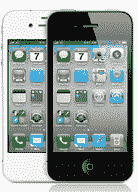

# 苹果应用商店应用下载量突破 150 万，1B 下载量上月增加| TechCrunch

> 原文：<https://web.archive.org/web/http://techcrunch.com/2011/07/07/apples-app-store-crosses-15b-app-downloads-adds-1b-downloads-in-past-month/>

# 苹果应用商店应用下载量突破 150 万，1B 下载量上月增加

苹果[刚刚宣布](https://web.archive.org/web/20230405064807/http://www.businesswire.com/news/home/20110707005466/en/Apple%E2%80%99s-App-Store-Downloads-Top-15-Billion)该公司的 2 亿 iOS 用户从其应用商店下载了超过 150 亿个应用，包括 iPad 和 iPhone 应用。App Store 目前包括超过 425，000 个应用程序，其中有超过 100，000 个原生 iPad 应用程序。

在六月初的[,](https://web.archive.org/web/20230405064807/https://techcrunch.com/2011/06/06/apple-15-billion-songs-sold-130-million-books-14-billion-apps-downloaded/)苹果透露应用商店已经有 140 亿的应用下载量，所以苹果在仅仅一个月的时间里已经积累了 10 亿的下载量。

当时，苹果还表示，iTunes 商店已售出 150 亿首歌曲，成为世界上排名第一的音乐零售商。App Store 下载了 1.3 亿本书，iTunes 列出了 2.25 亿个信用卡账户。

苹果还向基于 iOS 平台的开发者支付了超过 25 亿美元。