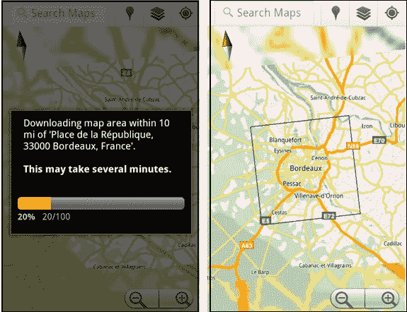

# 谷歌地图安卓版现在允许你下载地图离线查看(哈利路亚！)TechCrunch

> 原文：<https://web.archive.org/web/http://techcrunch.com/2011/07/07/google-maps-for-android-now-lets-you-download-maps-for-offline-viewing-hallelujah/?utm_source=feedburner&utm_medium=feed&utm_campaign=Feed%3A+Techcrunch+(TechCrunch>)

# 谷歌地图安卓版现在允许你下载地图离线查看(哈利路亚！)

无论你站在智能手机战争的哪一方，都很难否认 Android 的地图应用将 iOS 打得落花流水。本周情况变得更好。

昨天，谷歌强调了一个对经常使用地面公共交通工具的人来说超级方便的新功能:公交路线导航，这有助于确保你永远不会在错误的公交车站下车。他们刚刚[指出](https://web.archive.org/web/20230203041845/http://googlemobile.blogspot.com/2011/07/download-map-area-added-to-labs-in.html)另一个我渴望已久的伟大的附加功能。向离线地图问好，这要归功于实验室中一个名为下载地图区的新功能。

要激活该功能，您必须首先访问地图应用程序的实验室部分，您可以使用菜单按钮访问该部分。启用下载地图区域选项，从那时起，当你浏览到一个地点页面并点击“更多”按钮时，你会看到一个本地存储周围地区地图的选项。

这是一个很大的周边区域——谷歌将下载该场地 10 英里半径范围内的地图碎片的本地副本。这意味着你只需轻轻一点就可以轻松下载整个旧金山或曼哈顿(通过 Wifi 连接，下载本身就花了我大约一分钟的时间)。这样，下次你打开地图，但没有数据连接时，你仍然可以随心所欲地平移和缩放城市。

该功能之所以成为可能，是因为 Android 上的谷歌地图使用基于矢量的系统来显示地图平铺，而不是基于图像的旧系统(iOS 版本的地图仍在使用这种系统)。基于矢量的切片使用更少的数据(大约 1/100)，这意味着它们下载更快，并且可以存储在本地，而不需要使用太多的存储空间。谷歌地图 Android 版实际上已经自动缓存地图数据有一段时间了——这个“下载地图”功能带来的不同之处在于，它让用户明确选择在本地存储哪些区域。

这是一个很好的开始，但显然仍是一项进行中的工作。您不能在离线时查找公交地图，也不能对出现在您下载的地图区域中的地点和地址进行搜索查询。但是这些都是非常明显的特性，所以希望它们在管道中。