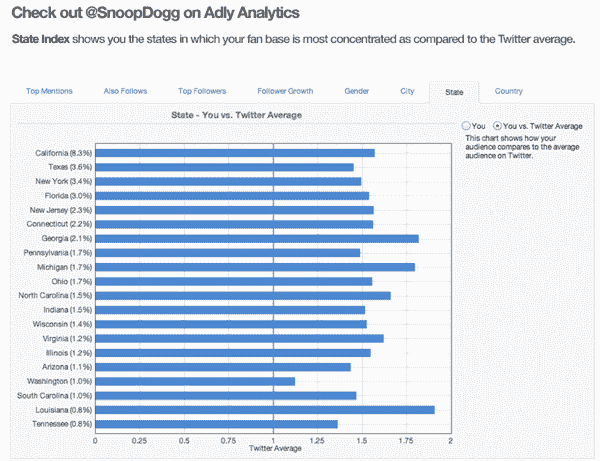
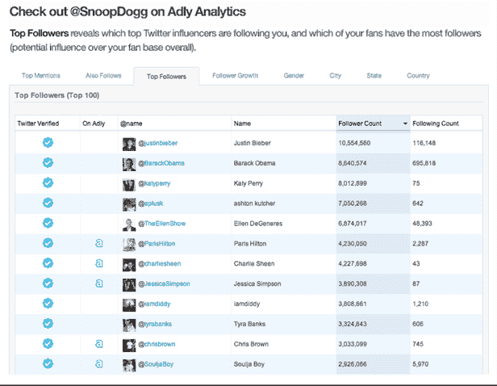

# 名人和品牌广告初创公司 Ad.ly 推出社交分析平台 TechCrunch

> 原文：<https://web.archive.org/web/http://techcrunch.com/2011/07/08/celebrity-and-brand-advertising-startup-ad-ly-launches-social-analytics-platform/>

# 名人和品牌广告初创公司 Ad.ly 推出社交分析平台

你可能还记得 [Adly](https://web.archive.org/web/20230203052944/http://adly.com/) ，一家在 Twitter 和 MySpace 等社交平台上为名人和品牌提供流媒体广告网络的初创公司。该公司也曾[帮助名人在脸书推广品牌](https://web.archive.org/web/20230203052944/https://techcrunch.com/2010/09/15/in-stream-ad-network-ad-ly-extends-reach-to-facebook-pages/)，但却被脸书解雇了(点击了解更多原因[)。作为背景，Ad.ly 将广告商与有影响力的人和名人联系起来，然后通过名人的推文流和 MySpace 更新流发布营销活动的链接，并完全公开。](https://web.archive.org/web/20230203052944/https://techcrunch.com/2011/04/09/ad-ly-versus-facebook-something-doesnt-add-up/)

今天，该公司推出了一个分析仪表板，旨在帮助顶级影响者管理和发展他们在 Twitter 上的受众。仪表板为品牌和名人提供其追随者的受众人口统计数据，并揭示谁是您的最大影响者，哪些影响者和粉丝正在向您发送消息，提到您，并转发您的内容。

Adly 还会向你展示你的粉丝还关注哪些其他名人和品牌，以及你们有多少共同的粉丝。你可以看到谁是你的“超级粉丝”(接触范围和潜在影响力最大的人)；一段时间内的追随者增长，与 Twitter 平均受众相比的追随者基础的性别细分，以及与 Twitter 平均受众相比的受众的地理细分。

例如，Snoop Dogg (@SnoopDogg)在德克萨斯州的 Twitter 粉丝比他在纽约的粉丝还多。Jet Blue (@JetBlue)可以看到其 24%的粉丝是 50 美分(@ 50 美分)的粉丝。老香料(@OldSpice)可以看到其 28%的追随者是查理·西恩的粉丝(@CharlieSheen)。《纽约时报》(@NYTimes)可以看到其 29%的追随者是 CNN 突发新闻的粉丝

Adly Analytics 还允许名人和品牌授权经理、代理商和员工访问他们的 Adly Analytics，而无需共享他们的 Twitter 密码。

毫无疑问，分析现在是任何品牌社交媒体战略不可或缺的一部分。有许多初创公司提供深度社交媒体分析，如 Viralheat、HootSuite、PeopleBrowsr、Netvibes 和托普斯。在社交媒体分析领域，我们已经看到了一些相当重要的退出，包括 Radian 6 和 Kosmix。在 Adly 的广告和代言平台上提供分析是有意义的。

当然，我们知道 Twitter 可能会有自己的高性能分析平台，特别是考虑到该公司最近对社交媒体分析初创公司 BackType 的收购以及去年对 small think 的收购。

目前，Adly 似乎没有违反 Twitter 广告条款的危险。但是 Twitter 并不是对开发者最友好的公司，并且[已经打击了一些在平台上使用广告的公司。Adly 也没有放弃最近收购的 Myspace。Adly 首席执行官阿尼·古洛夫-辛格认为 Myspace 可能会东山再起，特别是在吸引名人的时候。也许这就是 JT 加入的原因？](https://web.archive.org/web/20230203052944/https://techcrunch.com/2010/05/24/did-twitter-just-kill-tweetup-minutes-after-its-launch/)

