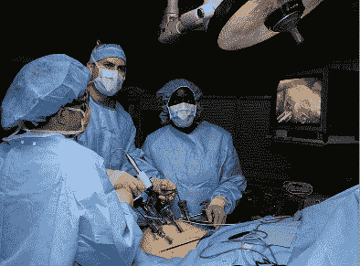

# 外科热线技术崩溃

> 原文：<https://web.archive.org/web/http://techcrunch.com/2011/07/10/hotwire-for-surgery/?utm_source=feedburner&utm_medium=feed&utm_campaign=Feed:+Techcrunch+(TechCrunch>)

*编者按:此客座博文由[Avado.com](https://web.archive.org/web/20230205041643/https://avado.com/)的首席执行官[戴夫·蔡斯](https://web.archive.org/web/20230205041643/http://www.crunchbase.com/person/dave-chase)撰写，该健康科技公司曾入围[tech crunch Disrupt](https://web.archive.org/web/20230205041643/https://techcrunch.com/2011/05/24/avado-is-the-mint-for-your-personal-health-records/)。此前，他是埃森哲医疗业务的管理顾问，也是微软健康业务的创始人。你可以在推特 [@chasedave 上关注他。](https://web.archive.org/web/20230205041643/http://twitter.com/#!/chasedave)*

今晚空着的旅馆床位再也卖不出去了。正是这种洞察力促使 hotel 创建了一个颠覆性的模式，为旅行者提供了优惠的酒店客房。事实证明，有各种各样的“床”和“套房”——手术套房/床——也有类似的现象。正因为顶级酒店很少被 100%预订，并且可以从其他空置床位中获得增量收入，顶级手术设施也有类似的动态。正是这种认识促使[国家手术网络](https://web.archive.org/web/20230205041643/http://www.nationalsurgerynetwork.com/)开发了手术治疗的全国市场。(*披露:全国手术网络可能成为我公司 Avado.com 的客户，所以我对其非常熟悉。*)

每年有超过 150 万的美国人通过所谓的[医疗旅游](https://web.archive.org/web/20230205041643/http://en.wikipedia.org/wiki/Medical_tourism)出国进行医疗手术。医疗游客通常寻求的服务包括择期手术以及复杂的专业手术，如心脏手术、牙科手术、关节置换和整容手术。然而，几乎每种类型的医疗保健，包括补充 T17 替代疗法、精神病学和康复护理，都通过节省高达 90%的医疗费用吸引了美国人。

美国的医疗保健提供商已经注意到自费雇主和健康计划。事实是，如果可以选择的话，大多数人宁愿为了医疗目的去图森，而不是泰国，以节省时间和不确定性。顶级外科机构意识到他们可以在价格上具有竞争力，并有额外的产能，因此他们已经开始了国内医疗旅游计划。如果你从逻辑的极端来看，它的副产品是创造了一个全国性的非紧急手术市场，这个市场在历史上一直是严格的地方性市场。正如《今日美国》最近[报道的](https://web.archive.org/web/20230205041643/http://www.usatoday.com/money/industries/health/2011-06-30-health-costs-wide-differences-locally_n.htm)，即使在同一个城市，同样的手术和同样的结果，医疗保健的成本通常[相差 600%或更多](https://web.archive.org/web/20230205041643/http://i.usatoday.net/money/_pdfs/110630-costs.pdf)(来源:[变化:医疗保健](https://web.archive.org/web/20230205041643/http://www.crunchbase.com/company/change-healthcare))，更不用说从一个城市到另一个城市了。

推动这些节约的经济因素很简单:

*   以高效、集中的设施为目标——许多研究表明，大规模实施手术的医生也有最好的结果。相反，医院做手术的频率越低，费用就越贵，结果也不如大批量的设备。围绕特定专业(例如，心脏手术)组织的设施及其工作人员可以高效和有效地提供护理。
*   简化支付–通过为大多数程序制定全面的案例费率，他们可以减少计费和报销的管理费用。手术后，病人不再收到无数的账单和所谓的利益解释。正如 NSN 首席执行官 Ken Erickson 所说，“我们的患者不再担心未支付的费用，并在手术后收到医院和医生的一封信…这是一封感谢信！”
*   推动这些提供商的增量——通过填充床位和手术时段，NSN 患者在经济上具有吸引力，其费用远低于传统报销。

国家外科网络是最先发现这一机会的机构之一，并创建了一个全国外科设施网络，该网络已整合为自费雇主健康计划(即雇主直接支付医疗费用，而不是购买传统保险)提供服务，这些雇主对支付员工健康费用的恶性通货膨胀感到沮丧。目前，1 . 1 亿美国人在自费的健康计划中。

这是另一个我称之为“自己动手进行医疗改革”的不断发展的运动的例子，比如早前在《没人听说过的硅谷最重要组织——T2》中描述的 MedLion。也就是说，像国家外科网络(National surgical Network)这样的组织已经迫不及待地等着政客们来修复人们普遍认为医疗保健中最脆弱、最昂贵的部分。相反，通过他们自己的尝试和错误，他们正在完善的照顾和支付模式，显示出令人印象深刻的结果。

对于能够为员工节省数十万美元医疗费用的雇主而言，价值主张是显而易见的，但对员工而言，它有什么好处呢？首先，NSN 仅与在外科手术程序方面表现出最佳记录的设施签订合同。离你最近的医院可能不会有好的结果，典型的消费者很难评估，而理解这一点是 NSN 的业务。其次，GetWell Benefit 还会在财务上奖励坚持出院方案和参与纵向随访的患者。

一位有长期心脏问题史的女性需要更换主动脉瓣。她所在地区市场的医院在心脏护理方面的评级很低。NSN 安排手术由奥斯丁心脏医院的一位顶尖外科医生来完成。尽管所需的手术比预期的更为复杂，但结果是完全成功的。这名患者报告说，尽管她已经进出医院多年，但这是她第一次得到护理，而不仅仅是治疗。NSN 有他们所谓的护理领航员(Care Navigators)来帮助一个可能会让患者感到恐惧的过程。

NSN 利用科技来支持个人互动。他们提供了一个在线健康信息门户，帮助患者选择提供者。他们还设有护理协调员，负责与每位患者建立个人关系。

他们使用一个安全的在线医疗记录系统，方便 NSN 专科医师和患者的本地/初级护理人员访问。每个使用 NSN 的患者都会收到自己的电子个人健康记录作为额外的福利。NSN 还在部署社交媒体，帮助患者分享他们的经历，并在适当的情况下在保护隐私和匿名的环境中相互联系。

TechCrunch 撰稿人兼风险投资家 Mark Suster 多次表示，企业家应该解决我们社会中真正的重大挑战——健康、教育和能源——而不是创造另一种社交工具、基于位置的服务或琐碎的应用程序。NSN 正在这么做。