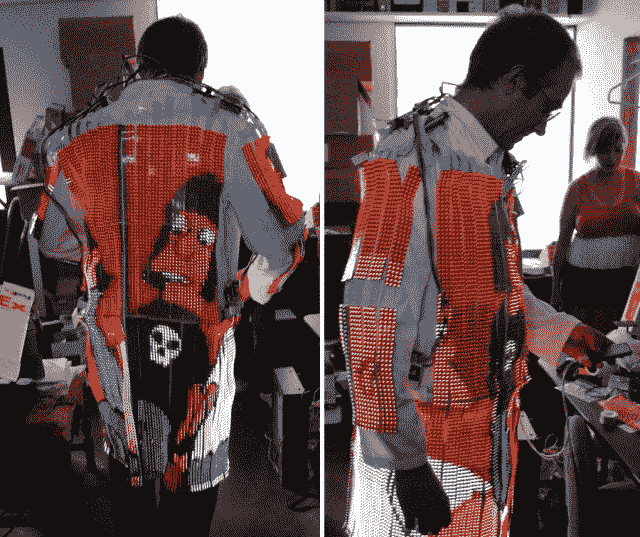

# Technicolor LED 电视 Dreamcoat 很棒，但有些不切实际 TechCrunch

> 原文：<https://web.archive.org/web/http://techcrunch.com/2011/07/11/technicolor-led-tv-dreamcoat-is-fantastic-but-somewhat-impractical/>

# 彩色 LED 电视梦幻外套是梦幻般的，但有点不切实际

【YouTube = http://www . YouTube . com/watch？这个勇敢的家伙计划在火人节穿上这件东西，你可能知道那是在沙漠里。除了一件装满多氯联苯、电池等物品的全套实验服之外，我想不出还有什么比这更让我喜欢的了。
 
电视播放 NTSC 视频，160×120(320×240 平滑缩放)。印刷电路板是柔性的，所以当你转动肩膀上的旋钮时，不必担心会弄坏它。电池能维持大约一个小时，可能比这个可怜的家伙在外面热死还要长。

[via [极客专家](https://web.archive.org/web/20230203123116/http://www.geekologie.com/2011/07/motion-sickness-a-wearable-led-televisio.php)