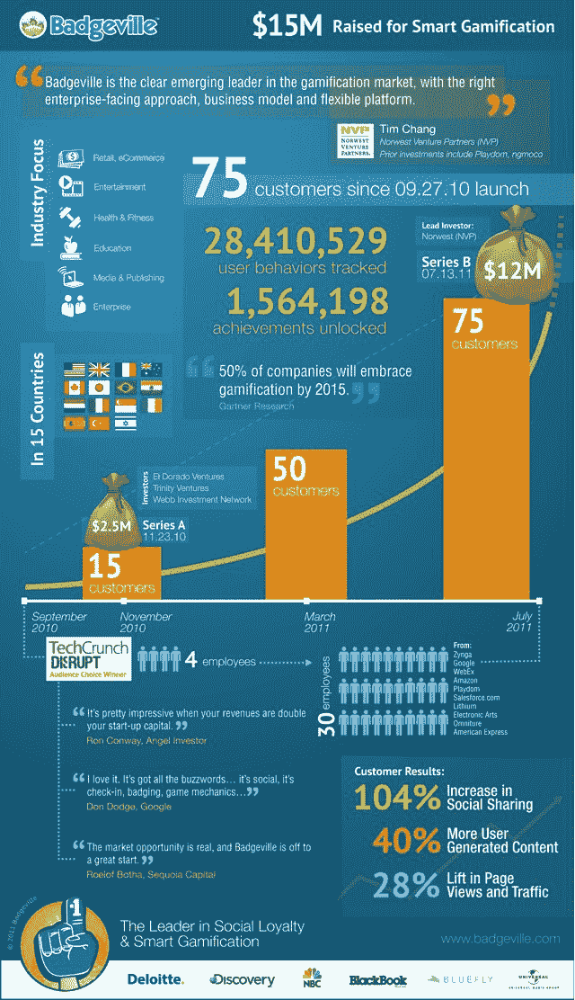

# Badgeville 筹集了 1200 万美元，用信息图庆祝 TechCrunch

> 原文：<https://web.archive.org/web/http://techcrunch.com/2011/07/12/badgeville-raises-12-million-celebrates-with-an-infographic/?utm_source=feedburner&utm_medium=feed&utm_campaign=Feed%3A+Techcrunch+(TechCrunch>)

# Badgeville 筹集了 1200 万美元，用信息图庆祝

创始人兼首席执行官[克里斯·达根](https://web.archive.org/web/20230203160308/http://www.crunchbase.com/person/kris-duggan)是这样一种人，他总是乐观积极得可笑，有时你真想掐死他。没人有权利这么开心。

一年前，我在《财富》头脑风暴会议上见到他时，他面带微笑，非常开心，他第一次向我展示了贝格维尔。去年九月，他在旧金山 TechCrunch Disrupt 的舞台上很开心[，同时](https://web.archive.org/web/20230203160308/https://techcrunch.com/2010/09/27/badgeville/)[推出他的公司](https://web.archive.org/web/20230203160308/https://techcrunch.com/2011/02/12/techcrunch-disrupt-badgeville-lessons/)并获得观众选择奖。

现在，他的快乐达到了一个全新的水平，因为他刚刚完成了第二轮融资——来自 [Norwest Venture Partners](https://web.archive.org/web/20230203160308/http://www.crunchbase.com/financial-organization/norwest-venture-partners) 和 [El Dorado Ventures](https://web.archive.org/web/20230203160308/http://www.crunchbase.com/financial-organization/el-dorado-ventures) 的 1200 万美元，还有之前的投资者 [Trinity Ventures](https://web.archive.org/web/20230203160308/http://www.crunchbase.com/financial-organization/trinity-ventures) 和 [Webb Investment Network](https://web.archive.org/web/20230203160308/http://www.crunchbase.com/financial-organization/webb-investment-network) 的参与。来自挪威的蒂姆·张和来自黄金国的汤姆·皮特森加入了公司董事会。

当达根没有过量服用多巴胺的时候(或者可能是当他过量服用多巴胺的时候)，他正在发展一个大公司。Badgeville 为网站提供游戏机制，鼓励用户更多地与这些网站互动。他们有 75 个已宣布的付费客户，季度收入达到“七位数”,并以每季度 40%的速度增长。顾客为这项服务支付年费。客户包括探索通信、NBC、Bluefly.com、Interscope Records、大联盟游戏、LiveMocha、主动网络和德勤数字。

来自诺西的常非常适合这家公司。他投资了 ngmoco 和 Playdom，非常了解游戏机制。他还投资了 [BranchOut](https://web.archive.org/web/20230203160308/https://techcrunch.com/2010/07/20/branchout-unlocks-the-linkedin-in-facebook/) ，这是一家初创公司，当人们把你加入他们的网络时，你会在你的电子邮件收件箱中不断看到它。

这是我在标题中提到的信息图。

