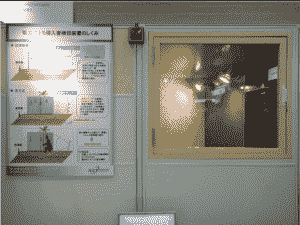

# 视频:家庭安全系统使用无线电信号检测入侵者 TechCrunch

> 原文：<https://web.archive.org/web/http://techcrunch.com/2011/07/12/home-security-radio/>

# 视频:家庭安全系统使用无线电信号来检测入侵者

视频和红外线是昨天:日本国家信息和通信技术研究所，NICT，正在研究一个完全基于无线电信号的家庭安全和监控系统。所谓的“入侵者检测系统无线电波网”(RAMIDS)的主要优点是在屏蔽区域不再有盲点。

该系统由一个发射器和天线组成，可检测信号幅度和相位的变化。根据预先设置的阈值，每当房间中的事件被监控并引起变化时(例如，当窗户被打开时)，就会触发警报。

有趣的是，RAMIDS 还可以用于老年护理。例如，在洗手间(由于显而易见的原因，无法安装摄像机)，系统可以检测到异常行为，即进入洗手间的人停止移动一段时间。

这段视频由 [Diginfonews](https://web.archive.org/web/20230203154827/http://www.diginfo.tv/2011/07/12/11-0142-r-en.php) 在东京拍摄，展示了 RAMIDS 的行动:
【YouTube = http://www . YouTube . com/watch？v = 1 qzvym 7 emmi&w = 560&h = 349】