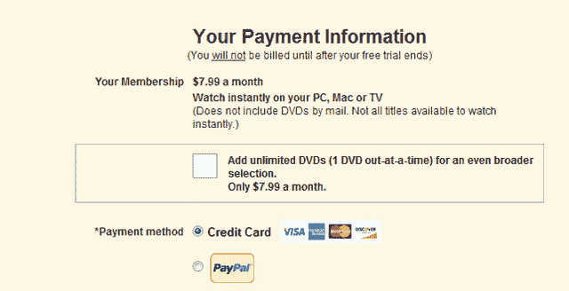

# 网飞调整价格，租赁这些塑料光盘变得更加昂贵

> 原文：<https://web.archive.org/web/https://techcrunch.com/2011/07/12/netflix-dvd-only/>

# 网飞调整价格，租赁这些塑料光盘变得更加昂贵

网飞官方正在全力进攻 DVD——至少他们刚刚发布的定价策略是这样说的。新的价格响亮而清晰地表明，流媒体是未来的发展方向，如果你不跟上潮流，你将付出代价。也许这就是为什么雷德·哈斯汀斯在 5 月份声称 DVD 出货量可能会有史以来第一次下降。

包括流媒体和 DVD 的计划已经一去不复返了。客户以前可以选择 7.99 美元的流媒体计划，然后再支付 2 美元，就可以一次租一张 DVD。现在这些计划是分开的，流媒体计划的价格是 7.99 美元，DVD 计划的价格是 7.99 美元；以 16 美元的价格选择这两个选项会导致价格上涨 60%。目前的用户在 9 月 1 日之前将能够享受较低的价格，但该计划刚刚针对新客户推出。哎哟。

[在网飞博客](https://web.archive.org/web/20230404033737/http://blog.netflix.com/2011/07/netflix-introduces-new-plans-and.html)上，价格上涨归因于将 DVD 租赁定位为一项正当的业务，而不仅仅是流媒体服务的 2 美元附加服务。网飞甚至创建了一个“独立和独特的管理团队”来领导 DVD 业务，现在由在网飞工作了 11 年的首席服务和运营官安迪·伦迪奇领导。这只是太糟糕的定价和网飞注册过程中陈述的东西不同。租赁 DVD 现在只是一项 7.99 美元的附加业务。

虽然网飞可能会声明 DVD 租赁是独立的，但事实并非如此。新客户在注册时会被简单地问及是否想加入每月 7.99 美元的服务；默认情况下会选择流媒体服务。

以前，我知道至少在我家，DVD 选项是一个很好的备份，以防特定的标题不可用于流媒体；这真的感觉像是 2 美元的附加产品。这种情况在去年发生了几次，因为网飞的流媒体目录大约有 2 万个标题，其中有 10 万个可用的 DVD。

Erick 在 5 月份采访了网飞的首席执行官。“流媒体是我们业务的核心，并且正在快速增长。”他说“就观看时间、增长和关注度而言，流媒体对我们来说比 DVD 重要得多。我们看到大量消费者采用流媒体技术。”这种对 DVD 租赁的背离似乎也说明了这一点。流媒体才是未来，而不是物理媒体。