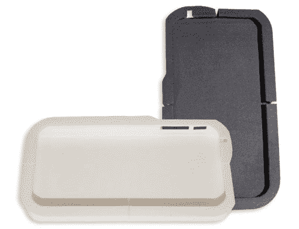

# 这一举措让你可以戴上没有肩带的 iPhone，看起来像托尼·斯塔克

> 原文：<https://web.archive.org/web/http://techcrunch.com/2011/07/12/the-move-lets-you-wear-your-iphone-sans-straps-look-like-tony-stark/?utm_source=feedburner&utm_medium=feed&utm_campaign=Feed%3A+Techcrunch+(TechCrunch>)

# 这一举措让你可以戴上没有肩带的 iPhone，看起来像托尼·斯塔克

当我看到这一举动时，我想到了三件事，一个让你不用任何带子、velcro 或磁铁就能把 iPhone 挂在衣服上的 [Kickstarter 项目](https://web.archive.org/web/20230203054542/http://www.kickstarter.com/projects/938455590/the-move-become-one-with-your-iphone?ref=live):

*   “我们是博格人。你会被同化的。”
*   “电弧反应堆，来自美国电话电报公司和斯塔克技术公司。现在有了 3G 支持和流猫视频。”
*   “…我有足够的冷静去实现它的可能性有多大？”

那么，它是如何工作的:胶水？喷气背包？巫术？实际上比这简单一点:这只是一种很好的时尚张力。

首先，你要把 iPhone 放在衣服后面的任何地方。然后你把你的 iPhone 放在衣服层和衣服层上面，把它推到合适的位置，让衣服层和衣服层的张力把它固定住。

我们就直说了吧:是的，把你的 iPhone 塞进你的衣服里会让你看起来像超级书呆子中的超级书呆子——但是 10 年前，仅仅拥有一部智能手机也是如此。随着短程无线技术、电池和显示技术变得越来越难/越来越好/越来越快/越来越强，可穿戴设备将成为我们未来的一大部分(如果不是作为主要设备，那么就是作为与主要设备和你的环境进行交互的一种方式)，这是一种让你的 iPhone 今天成为一种伪可穿戴设备的粗糙方式。今天的超级书呆子就是明天的酷小子。

有一点视频并没有真正触及它应该在的地方:这个东西到底有多贴合？显然，这对于慢跑来说足够舒适了(见下面视频中的 1:37)，但如果我的 iPhone 只是因为我跳得有点太用力而不合时宜地接触到冰冷坚硬的混凝土，这个想法就有点土崩瓦解了。

该项目的幕后人员表示，他们需要 2.5 万美元来启动项目，目前他们只筹集了大约 250 美元。由于这是一个 Kickstarter 项目，他们希望通过认捐来筹集资金；2 美元让你成为贡献者，25 美元让你有所行动，45 美元让你有两个，还有其他选择给那些想要更多现金的人。