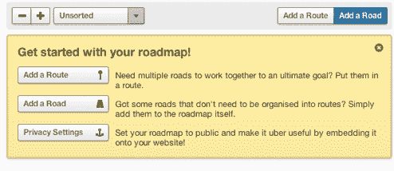
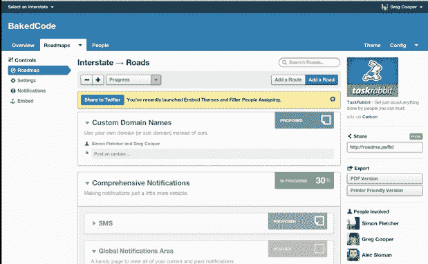

# YC 资助的州际公路在地图上标出您的开发进度 TechCrunch

> 原文：<https://web.archive.org/web/https://techcrunch.com/2011/07/12/yc-funded-interstate-plots-your-development-progress-on-the-map/>

当涉及到构建一个可靠的软件产品时，一个关键的因素是确保你的开发团队、项目经理和其他关键人员都在同一页上。这种需求催生了各种各样的服务和应用程序，旨在让这一切变得更加简单。今天，Y Combinator 资助的公司[烘焙代码](https://web.archive.org/web/20230203042827/http://bakedcode.com/)为我们带来了一个新的、看起来光滑的进入这个市场的入口，叫做[州际](https://web.archive.org/web/20230203042827/http://www.interstateapp.com/)。

创始人 Greg Cooper 和 Simon Fletcher 说，[州际](https://web.archive.org/web/20230203042827/http://www.interstateapp.com/)的目标是为开发者提供一个跟踪工具，在 37signals 的 [Basecamp](https://web.archive.org/web/20230203042827/http://basecamphq.com/) 和 [PivotalTracker](https://web.archive.org/web/20230203042827/http://www.pivotaltracker.com/) 之间找到平衡点，他们说这是相当基本的东西，而[pivotal tracker](https://web.archive.org/web/20230203042827/http://www.pivotaltracker.com/)有许多螺母和螺栓。

该应用程序包含了开发路线图应用程序应有的功能:您可以了解每个任务(和子任务)的当前状态，规划出未来几周的发展方向，并为每个任务添加补充文件。哦，它看起来非常漂亮(如果你愿意，你可以调整主题)。

首次登录后，会要求您开始规划路线图。任务可以被创建为“道路”，而道路又可以被捆绑在一起以创建总体“路线”。项目管理员可以邀请同事，还可以设置他们可以编辑和查看哪些路线图。

还有一个创始人认为是 Interstate 独有的功能:该应用程序允许开发者公开展示他们路线图的一部分(或者全部，如果你觉得特别透明的话)。这可以帮助用户了解你当前的进展，而不必处理源源不断的来电询问(这是最初开发这款应用的动机之一——库珀和弗莱彻表示，他们厌倦了被问及他们的进展)。

此时，Interstate 将作为免费的公共测试版发布，但最终该服务将开始收费(创始人表示，他们仍在确定理想的价格点和模式)。该公司已经拥有一些知名客户，包括 DailyBooth、Seesmic、Media Temple、弗吉尼亚理工大学和密歇根理工大学。

除了前面提到的 Basecamp 和 PivotalTracker，Interstate 还将与 [Asana](https://web.archive.org/web/20230203042827/http://asana.com/) 展开竞争(后者仍处于私人测试阶段)。如果您正在寻找一种不一定针对开发人员的管理工具，请参见 MetaLab 的[流程](https://web.archive.org/web/20230203042827/http://www.getflow.com/)。

请注意，这是 Baked Code 的第一个产品，听起来最终可能会有更多的产品。

