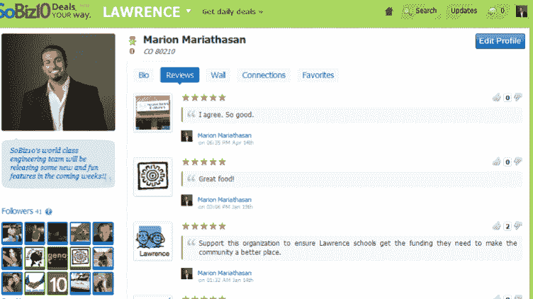

# 反向价格线？SoBiz10 测试自动化的、消费者驱动的交易服务(有点慈善)

> 原文：<https://web.archive.org/web/http://techcrunch.com/2011/07/13/a-reverse-priceline-sobiz10-tests-automated-consumer-driven-deals-service-with-a-touch-of-charity/>

亲爱的读者，我希望你不会厌倦每日交易，因为我有更多的每日交易新闻要告诉你。不断发展的每日交易模式的最新趋势包括现在流行的“交易钱包”和“交易转售市场”，不少初创公司已经开始实施，例如 [City Pockets](https://web.archive.org/web/20230203044400/https://techcrunch.com/2011/06/20/daily-deal-wallet-citypockets-raises-735k-adds-secondary-marketplace-for-deal-resale/) 和 [DealsGoRound](https://web.archive.org/web/20230203044400/https://techcrunch.com/2011/06/21/dealsgoround-launches-deal-wallet-to-let-consumers-organize-daily-deals-in-one-place/) 等等。

交易模式的另一个领域似乎正在经历一次回归，那就是消费者驱动交易(CDD)方法，在这种方法中，网站让消费者决定他们希望看到他们最喜欢的本地商家提供的交易。Ringleadr [最近推出了一项服务](https://web.archive.org/web/20230203044400/https://techcrunch.com/2011/06/23/ringleadr-raises-500k-launches-service-to-let-users-create-their-own-deals/)，让消费者进入驾驶舱，Loopt [也推出了新的“U-Deals”](https://web.archive.org/web/20230203044400/https://techcrunch.com/2011/06/23/off-and-running-loopts-first-u-deal-sells-out-in-less-than-an-hour/)。

消费者驱动的交易(或者反向交易，如果你喜欢的话)之前已经被初创公司尝试过，没有取得巨大的成功，但这并不是说没有迭代和颠覆的空间，因为这个领域整体上仍然相对年轻。虽然 Ringleadr 和 Loopt 都提供了很好的服务，但其模型结构的一个潜在缺点是，消费者必须等待 15 天(就 Ringleadr 而言)才能获得商家的批准。这是在消费者让一群朋友对交易感到兴奋，足以越过临界点之后，然后必须等待两周以上，等待商家*也许*决定批准。

科罗拉多州的一家初创公司 SoBiz10 正试图通过缩短商家批准交易的时间来进一步向 CDD 施压。这家初创公司正在采取“消费者在他们想要的时候，以他们想要的价格，获得他们想要的交易”的方法，更不用说这一切都是完全自动化的。当然，这种即时性可能听起来像是消费者的暴政，但 SoBiz 希望通过让企业能够以低于集团优惠券网站的典型收入份额(25%)产生和保留新客户来抵消这种潜力。(平均值约为 50%。)

但是，在进一步深入之前，SoBiz 是这样工作的:用户召集他们的 10 个朋友一起决定他们想要的交易和他们想要光顾的商家。然后，用户在 SoBiz 上发布这笔交易，此时商家会收到电子邮件、短信和语音邮件，提醒他们这笔交易。商家有 48 小时的时间来接受、拒绝或还价。如果交易被接受，这 10 名用户会立即收到一封电子邮件，并可以使用该初创公司的安全支付系统支付优惠券。

从那里，商家能够在 SoBiz 市场上更广泛地显示交易，并可以选择控制可用性，SoBiz 进而提醒社区成员该交易更广泛可用。在商家方面，SoBiz10 运营总监约翰·摩根斯(John Morgans)说，商家唯一要做的就是创建个人资料，成为会员。他们创建个人资料后，会出现一个页面来启用 CDD 通知。在这里，商家可以创建他们希望出现在所有交易上的小字，并输入银行路由信息，以便在每笔交易结束后的 2 到 3 个工作日内发送付款。

同意条款后，CDD 通知将启用，他们的业务将开始接收 cdd，包括直接发送给他们的 cdd 以及发送给他们整个业务类别的 cdd。每次他们收到 CDD，都会收到通知。

SoBiz take 的另一个卖点是，每售出一张优惠券，就有 25 美分捐赠给交易创建者选择的慈善机构，这为这项服务增加了一个非营利和令人愉快的元素。SoBiz 上的每个非营利组织都有自己的简介。任何时候，他们都可以登录并在仪表板上查看捐赠了多少钱。当他们准备提取捐款时，他们会给 SoBiz 发电子邮件，然后 SoBiz 会给他们寄一张支票。摩根士丹利表示，他们也在致力于这一过程的自动化。

SoBiz 平台另一个有趣的部分来自于这样一个事实，即创始人兼首席执行官 Marion Mariathasan 和他的团队最初将该服务打造为一个社交网络，并将每日交易组件作为一个附加组件。从上图可以看出，用户和商家可以创建个人资料，就像在脸书上一样，可以写以前交易的评论，与朋友和商家联系，等等。

该服务还包括搜索功能以及交易分类，因此消费者可以按类别请求交易。如果用户不知道谁是最好的商家，比如说，一副新的老花镜，他们可以进入“视觉类别”来搜索眼镜商家。与 Groupon 和其他交易网站相比，分类是一个额外的奖励——它为疯狂的优惠券世界增加了一个急需的组织层次。

Mariathasan 将这种服务比作一种反向的 Priceline.com(T4)，除了在 Priceline 的情况下，消费者只是对 Priceline 已经谈妥的交易做出反应，而自动化的消费者驱动交易将客户放在驾驶座上。

SoBiz10 一直在丹佛和堪萨斯城测试其模型，有超过 17，000 名消费者和 2，000 名商家参与。这家初创公司最近与一家全国性优惠券公司建立了第一个大型合作伙伴关系，但尚未透露合作条款或公司名称，尽管还有两家公司正在与 SoBiz 进行谈判。更多的来了。SoBiz 目前正在创业，并寻求风险投资，以帮助将其服务推广到其他城市。

最后，这家初创公司向 TechCrunch 的读者提供了 100 个免费的私人测试版密钥，你可以通过给 contact@SoBiz10.com 的团队发电子邮件来利用这些密钥。Mariathasan 表示，SoBiz 计划在今年夏天晚些时候推出其公共测试版。

更多关于 SoBiz 的信息，请看下面的视频:

[YouTube = http://YouTube . be/0 pgt pl 9 plto]