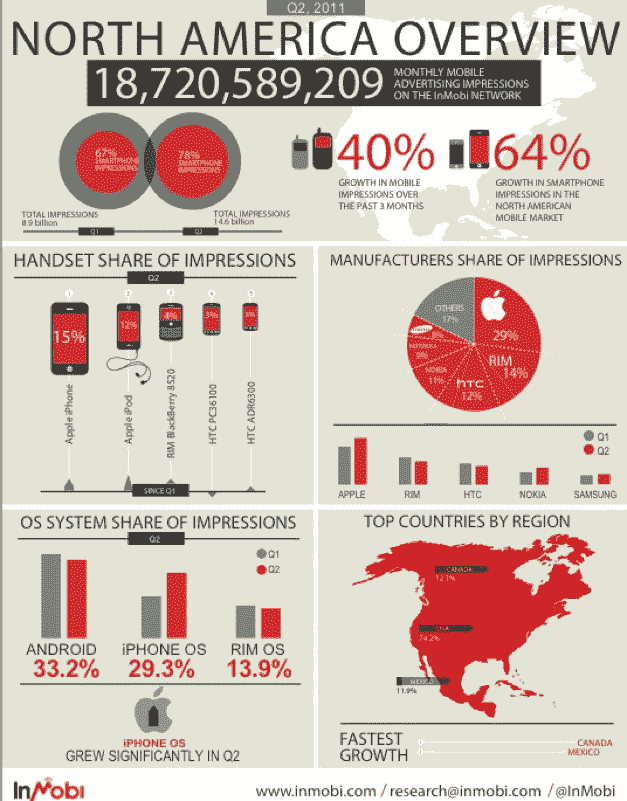

# InMobi:北美 78%的移动广告在智能手机上 TechCrunch

> 原文：<https://web.archive.org/web/http://techcrunch.com/2011/07/13/inmobi-mobile-ads-78-percent-smartphones/>

# InMobi:北美 78%的移动广告在智能手机上

北美的移动广告正到达一个拐点。根据[发布的一份新报告](https://web.archive.org/web/20230203034241/http://www.inmobi.com/research/)，在 2011 年第二季度，广告网络 [InMobi](https://web.archive.org/web/20230203034241/http://www.inmobi.com/) 上 78%的移动广告展示是在智能手机上(相对于旧的功能手机),比第一季度的 67%有所上升。“我们预计到第四季度末，90%的广告将出现在智能平台上，”全球研究和营销副总裁 James Lamberti 说。其中一半的广告将会出现在应用程序中。

在智能手机广告增长 65%的推动下，美国的移动广告总浏览量增长了 40%。从全球来看，智能手机广告的比例要小得多，只有 38%，高于第一季度的 32%。

InMobi 在第二季度为北美 187 亿移动广告提供服务，也报告了操作系统的细分情况。Android 以 33.2%的份额领先，但它的份额被 iOS 夺走，增长到 29.3%(RIM 为 13.9%，也有所下降)。在 1 月 5 日的 T4，安卓系统拥有 37%的市场份额，iOS 系统拥有 23%的市场份额。

