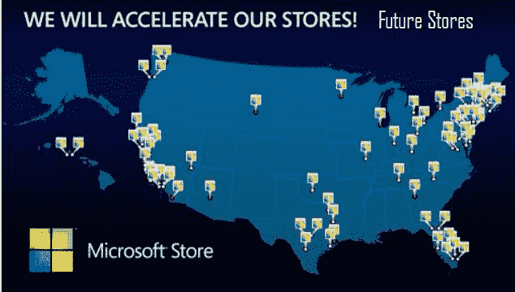

# 微软准备通过 75 家零售店挑战苹果商店 TechCrunch

> 原文：<https://web.archive.org/web/https://techcrunch.com/2011/07/13/microsoft-ready-to-take-on-apple-stores-with-75-more-retail-stores/>

# 微软准备再开 75 家零售店来挑战苹果商店

微软显然已经完成了零售领域的试水。首席运营官·凯文·特纳最近向微软全球合作伙伴会议的与会者展示了该公司的零售扩张计划，他表示，该公司已准备好迎头痛击。

该计划是在未来两到三年内再开设 75 家实体零售店。与过去两年开设的 11 家微软商店相比，这是一个巨大的增长。准备好。微软 vs 苹果大战即将来到你附近的一个商场。不过，明智的选择是苹果。

 
看起来大多数商店都在目前还没有微软商店的美国东北部地区。两个去夏威夷，佛罗里达，德克萨斯和加利福尼亚也有很多。地图显示有几个分散在中部。

就像现在的微软商店一样，这些商店的特色不仅仅是个人电脑。他们将储存和展示 Xbox 360s、Window Phones、软件和不叫 iPod 的媒体播放器。他们甚至会时不时地唱一首小曲，跳一段小舞。

今天，当微软首席运营官凯文·特纳在微软全球合作伙伴大会上展示上述幻灯片时，这一计划被公之于众。Neowin 设法[得到了绘制计划位置的幻灯片](https://web.archive.org/web/20230205004050/http://www.neowin.net/news/microsoft-unveils-location-of-75-new-retail-stores-on-a-map)。

这条消息再及时不过了。就在今天,《今日美国》报道称苹果是美国增长最快的零售商。今年前三个月，苹果的销售额增长了 46 亿美元，比去年同期增长了 80%。他们的零售数量如此之大，以至于《今日美国》援引零售专家大卫·伯曼的话说，仅苹果商店就占了美国上市零售商的五分之一。仅 iPhone 的销量就比去年增长了 113%。

微软将在一段时间内落后于苹果商店的数量，如果不是永远的话。这可能并不重要，因为微软可能正在寻求征服某些地区，而不是整个世界。但是不要认为统治世界是不可能的。这是微软。