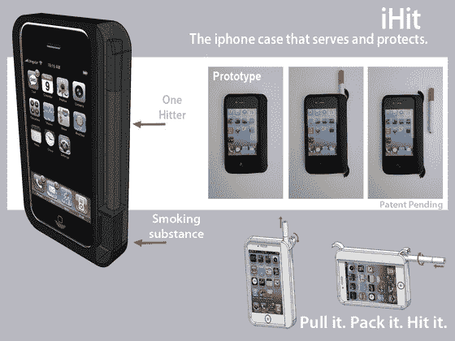

# iHit iPhone 保护套无效地隐藏了你的秘密

> 原文：<https://web.archive.org/web/http://techcrunch.com/2011/07/13/the-ihit-iphone-case-ineffectively-hides-your-stash/?utm_source=feedburner&utm_medium=feed&utm_campaign=Feed%3A+Techcrunch+(TechCrunch>)

# iHit iPhone 保护套无效地隐藏了你的存货

这个 Kickstarter 项目虽然高尚，但似乎有点被误导了。这款为 iPhone 4 设计的保护套有一个小侧箱，可以用来“随身携带各种小东西，比如维生素和薄荷糖”，或者，除了这些杂物，还有一支 loosie cig 或(这只是猜测)一支“大麻”。我只能想象“fuzz”对这种明显试图掩盖“魔鬼草”消费的反应，这似乎是一个非常不平衡的手机壳。

20 美元买一个盒子，25 美元买一个盒子和一种叫做“一击器”的东西，它允许主人用一个形状像香烟的小金属管不连续地吸少量的烟草。我的理解是，这些“一击”因其方便和时尚的造型而受到重金属听众、溜冰者和“heshers”的欢迎。没有暗示或保证其他用途。

这项发明是由 Mssrs 发明的。乔舒亚和爱德华，最近在佛罗里达州的迈阿密，我相信这两位先生会在消费非法物质的同时，在构思古怪案件的行业中走得很远。

相关新闻，新的[与罗马](https://web.archive.org/web/20230204121152/http://www.sublimewithrome.com/)一起升华专辑刚刚发行。

【YouTube = http://www . YouTube . com/watch？v=isuVU40HZJ4]

[项目页面](https://web.archive.org/web/20230204121152/http://www.theihit.com/)