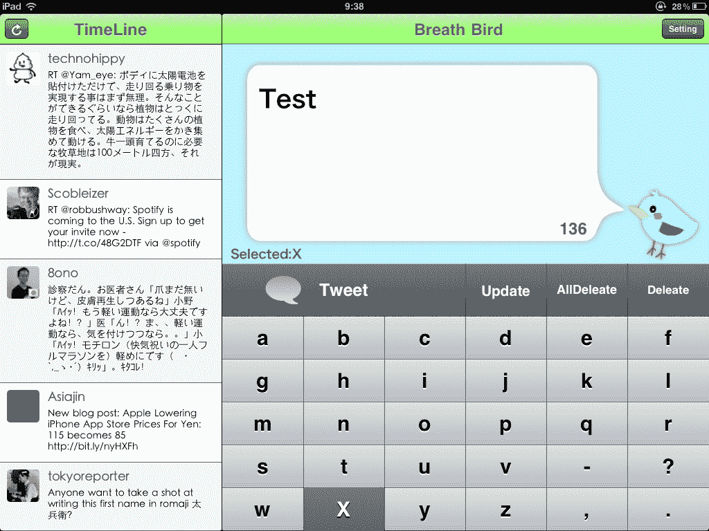

# 呼吸鸟:新的 Twitter 客户端让残疾用户可以用他们的呼吸发微博

> 原文：<https://web.archive.org/web/http://techcrunch.com/2011/07/14/breath-bird-new-twitter-client-lets-handicapped-users-tweet-with-their-breath/?utm_source=feedburner&utm_medium=feed&utm_campaign=Feed%3A+Techcrunch+(TechCrunch>)

# 呼吸鸟:新的推特客户端让残疾用户可以用他们的呼吸发推特

一家名为[tech firm](https://web.archive.org/web/20230204233201/http://www.techfirm.co.jp/)【JP】的日本公司刚刚在 App Store [ [iTunes](https://web.archive.org/web/20230204233201/http://itunes.apple.com/us/app/breath-bird/id438630073?mt=8) ，英语和日语双语]发布了一个非常特别(免费)的 iPad Twitter 客户端:“呼吸鸟”让不能使用手指和说话有问题的人通过对着 iPad 的麦克风呼吸来发布 Twitter。

它的工作方式是，当你启动应用程序时，你的时间线出现在屏幕的左侧(它会自动刷新以保持简单)。

在右边，屏幕上出现一个键盘，从 a 到 z 的所有字符分成五行(见下文)。Breath Bird 开始从上到下一个接一个地突出显示每一行。如果你想要“输入”的字符所在的行被高亮显示，对着麦克风呼气，让应用程序从左到右依次高亮显示该行中的所有字符。

一旦有问题的角色被突出显示，再次呼吸，它就会出现在屏幕顶部的推特气泡中——重复创建完整的单词和句子，可以以同样的方式发布到推特上。

我尝试了 Breath Bird out:这个过程一开始很繁琐，但这个应用程序实际上运行得很好(如果有外部麦克风，肯定会更好)，更重要的是，它可能是目标群体的天赐之物。