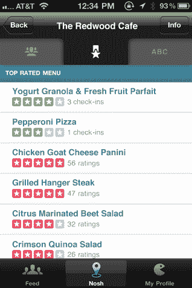

# Firespotter Labs 发布 Nosh:一个以食物为中心的 Instagram，它会告诉你该点什么

> 原文：<https://web.archive.org/web/http://techcrunch.com/2011/07/14/firespotter-labs-launches-nosh-a-food-centric-instagram-thatll-tell-you-what-to-order/>

谷歌之声的联合创始人回来寻求更多。他饿了。

早在 5 月[我们就报道了](https://web.archive.org/web/20230203071808/https://techcrunch.com/2011/05/04/google-voice-ceo-craig-walker-launches-firespotter-a-google-ventures-funded-incubator/)[炉窑实验室](https://web.archive.org/web/20230203071808/http://www.firespotter.com/)的，这是一个由葛兰素史克联合创始人兼首席执行官[克雷格·沃克](https://web.archive.org/web/20230203071808/http://www.crunchbase.com/person/craig-walker)创立的新孵化器(葛兰素史克于 2007 年被谷歌[收购](https://web.archive.org/web/20230203071808/http://techcrunch.com/2007/07/02/deal-is-confirmed-google-acquired-grandcentral/)并于 2009 年重新命名为谷歌之声)。沃克于 2010 年末离开谷歌语音团队，在谷歌风险投资公司做了一段时间的常驻企业家，并为 Firespotter 打下了基础——其中包括结束由谷歌风险投资公司牵头的 300 万美元的融资回合。

现在，就在停止资助几个月后，Firespotter 推出了它的第一个应用程序:一个名为 [Nosh](https://web.archive.org/web/20230203071808/http://www.nosh.me/) 的应用程序，它可以很容易地与你的朋友分享你正在吃的食物的快照(它也做一些更有用的事情，所以继续阅读)。它由 Instagram、Yelp 和 Foursquare 组成，有一些独特的破折号。该应用刚刚在[苹果手机](https://web.archive.org/web/20230203071808/http://itunes.apple.com/us/app/nosh/id442976546?mt=8)和[安卓](https://web.archive.org/web/20230203071808/https://market.android.com/details?id=com.nosh&feature=search_result)上上线——还有一个光滑的[网络版本](https://web.archive.org/web/20230203071808/http://www.nosh.me/)。

Nosh 的基本前提是，人们喜欢和他们的朋友分享他们正在吃的东西(只需看看你的 Instagram 或推特)。他们也想知道当他们在餐馆时，他们应该吃什么。Nosh 让两者都很容易做到。

当你第一次启动这个应用程序时，系统会提示你连接你的脸书和推特账号，这样你就可以快速建立一个也在吃东西的朋友列表。从那里，你会有几个选择。最重要的是“小吃”——这项服务相当于入住登记。这个想法是，你去一家餐馆，给你点的东西拍张照片，然后留下一个快速评论和/或评论。该应用程序包括标准的“附近地点”列表，有助于快速找到餐厅。

另一个重要的特点是饲料。这很像你在 Instagram、Path 和其他照片分享应用程序中找到的东西:点击它，你会看到你的朋友最近为他们自己的饭菜拍摄的一系列照片，以及他们自己对他们的饭菜的评论和意见。

但是 Nosh 不仅仅是帮助你分享和浏览食物的照片，它实际上是有用的。该公司目前在印度有一个团队，从美国各地的餐馆摄取数千份菜单(他们正在使用一些内部建立的技术来快速完成这项工作，所以它不仅仅是手动输入)。这个想法是，当你去登记一个地点时，你也能看到一家餐馆提供哪些饭菜——它们将包括其他食客留下的评论。换句话说，这有点像是对个别菜肴的叫卖，而不是对餐馆本身的叫卖。

我已经试用这款应用几天了(显然，虽然我还没有太多朋友在上面),它做得很好。它看起来很好，而且通常是经过打磨的——一旦有更多的美食评论，它可能会真正有用。我唯一的主要抱怨是:目前你不能拍摄你在家里做的东西的照片(目前所有照片都与一个地点相关联)，但这个功能将在下一个版本中添加。同时，如果你真的想的话，你可以创造一个新的叫做“家”的地方。

Nosh 正在做的大部分事情并不新奇( [Foodspotting](https://web.archive.org/web/20230203071808/http://www.foodspotting.com/) 也围绕着拍摄餐馆菜肴的快照)。但它很好地将它们捆绑在一起——事实上，它实际上有一些用途(计算在餐馆点什么)，而不仅仅是一个有趣的消遣，这可能会让用户回到应用程序，这一直是这些服务启动的最大障碍。

虽然他对 Nosh 感到兴奋，但 Walker 说 Firespotter 还在开发更多的产品——他希望一旦团队全速运转，他们将每年推出三到四种新产品。
【YouTube = http://www . YouTube . com/watch？v=oFdvqe13u34]
