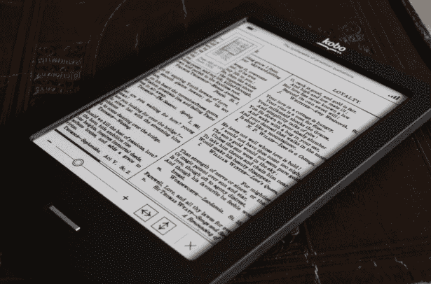

# Borders 可能已经死了，但电子阅读器 Kobo 仍然活着 TechCrunch

> 原文：<https://web.archive.org/web/https://techcrunch.com/2011/07/18/borders-may-be-dead-but-e-reader-kobo-is-still-alive-and-kicking/>

# Borders 可能已经死了，但电子阅读器 Kobo 仍然活着

我已经长大了，还记得当我走进像 Borders 这样的连锁店，亲自挑选书籍是为了节省时间。此外，正如任何一个书虫都会告诉你的那样，在书店的书架上搜寻埋藏的宝藏，并向博学的员工询问他们的阅读建议，这是一种奇怪的令人兴奋的感觉，即使是在特许经营店。有时(在我失业的作家时代),我会去最近的边境，坐在地板上打开一本书，一整天都在读，直到读完，就像这是一个图书馆。有时我甚至会买些东西。

显然，对于 Borders 来说,“买东西”这种事情已经不再经常发生了；《华尔街日报》今天报道称，Borders 将关闭 399 家门店，解雇 11，000 名员工。

上次我给 Borders 写了一篇文章，标题是[“互联网取得了今天的第二次胜利，Borders 濒临破产，”](https://web.archive.org/web/20230203121334/https://techcrunch.com/2011/02/11/borders/)将连锁的麻烦与报纸不能[及时逆转](https://web.archive.org/web/20230203121334/https://techcrunch.com/2011/02/11/rip-newspapers/)一则新闻故事的事实并列。但也许并不是互联网，而是 Borders management 处理互联网的方式导致了它的衰落。

正如 Harry McCracken [在一篇关于该公司消亡的深思熟虑的帖子中写道](https://web.archive.org/web/20230203121334/http://technologizer.com/2011/07/18/borders-is-toast-but-dont-blame-e-books/)“我上次在 Borders，那是上周，当我进入时，我遇到的第一件事就是一大桌子的 Kobo 读者。但是这显然太少了，也太迟了。Borders [在 2009 年宣布与 Kobo 合作，远远落后于竞争对手 Barnes and Noble 的 Nook。](https://web.archive.org/web/20230203121334/http://bits.blogs.nytimes.com/2009/12/15/borders-and-kobo-will-develop-new-e-reader/)

Kobo 在 Borders 于 2 月份申请破产保护时，声称其独立于 Borders，鉴于关闭的消息，kobo 今天给我们写了以下加强独立性的内容:

> “作为 Kobo 的早期投资者之一，Borders 拥有我们公司的少数股权，并与沃尔玛、百思买、西尔斯和其他零售商一起作为我们在美国的分销渠道的一部分。作为更广泛的图书出版和零售社区的一员，我们饶有兴趣地关注着 Borders 的故事，并向所有 Borders 人致以最美好的祝愿。
> 
> 6 月，Kobo 和 Borders 开始将 Borders“客户”的电子书账户转移到 Kobo，以提供对最新电子阅读功能、应用和设备的直接访问。 Kobo 用户将继续像往常一样使用他们的电子阅读器设备，在 Kobo 商店浏览和购买新游戏，不会中断服务。Kobo 在美国和世界各地继续增长，我们非常高兴与 Kobo 德国合作推出新的 Kobo eReader Touch Edition 和欧洲办事处。"

现在你知道了，拥有 Borders 电子阅读器账户的 Borders 用户基本上都拥有 Kobo 账户。我仍然没有收到 Kobo 的消息，Borders 在 Kobo 的股份是否会被 liquidator Hilco Consumer Capital 和 Gordon Brothers 持有，但我猜测它们会与 Borders 的其他资产一起转移(当我发现时会更新这篇文章)。你可以在这里阅读 Devin Coldewey 对 Kobo 设备[的全面和更具技术性的评论。](https://web.archive.org/web/20230203121334/https://techcrunch.com/2011/06/13/review-kobo-ereader-touch-edition/)

Borders 的故事尤其令人心酸的是一个细节，路易斯·博德斯是 90 年代失败的初创公司 Webvan 的创始人，该公司是在线杂货交付的先锋，后来于 2001 年破产。正如《旧金山商业时报》提到的，颇具诗意的是，Borders 的[支持和反对](https://web.archive.org/web/20230203121334/http://www.bizjournals.com/sanfrancisco/blog/2011/02/first-webvan-then-borders-louis.html)实体店的赌注导致了我们这个时代最具象征意义的两起与互联网相关的破产。

Borders 在 90 年代中期上升，在 2000 年代下降，这也是投资者 Marc Andresseen 的评论[的逆转](https://web.archive.org/web/20230203121334/http://alexiatsotsis.com/2011/06/04/almost-every-dot-com-that-failed-in-the-90s-will-succeed-now/)，所有当时失败的创业公司现在都会成功。该公司经历了一段短暂的历史，在这段历史中，前往大型非个人化的图书超市实际上是消费者最方便的选择，但却未能赶上下一波浪潮。撕开边框。Kobo 万岁(至少在理论上)。

