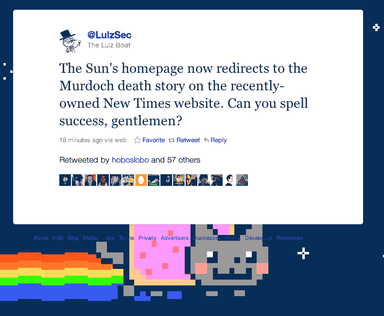

# LulzSec 攻击默多克旗下的《太阳报》，将主页重定向至@LulzSec Twitter 账户 TechCrunch

> 原文：<https://web.archive.org/web/http://techcrunch.com/2011/07/18/lulzsec-hacks-the-sun-redirects-homepage-to-fake-murdoch-death-story/?utm_source=feedburner&utm_medium=feed&utm_campaign=Feed%3A+Techcrunch+(TechCrunch>)

# LulzSec 攻击默多克旗下的《太阳报》，将主页重定向至@LulzSec Twitter 账户

看起来黑客组织 LulzSec 又开始行动了，这一次[将默多克所有的*的*](https://web.archive.org/web/20230204214022/http://twitter.com/#!/LulzSec/status/93071284837154816)*[主页](https://web.archive.org/web/20230204214022/http://www.thesun.co.uk/sol/homepage/)重定向到默多克所有的*伦敦*时报*改版[http://www.new-times.co.uk/sun](https://web.archive.org/web/20230204214022/http://www.new-times.co.uk/sun)的网址上一个关于默多克死于药物过量的虚假报道。在请求量导致《纽约时报》网站出现 404 故障后，该组织随后将《太阳报》的主页重定向到推特账户。(原页面在[http://freze.it/pX](https://web.archive.org/web/20230204214022/http://freze.it/pX)存档)

在我看来，这个假故事是为了反映一个真实的《太阳报》的故事，关于混乱的默多克/新公司/《世界新闻报》的最新进展。大约 10 分钟后(我发誓真实的 Sun 主页被重定向了),这篇假新闻被从英国《泰晤士报》的网站上撤了下来。我在下面附上故事的全文:

> # 媒体大亨尸体被发现

> 警方宣布，有争议的媒体大亨鲁珀特·默多克被发现死在自己的花园里。
> 
> 现年 80 岁的默多克据说在昨晚深夜跌跌撞撞地走进他著名的植园花园之前，摄入了大量的钯，并在凌晨时分死去。
> 
> “我们在厨房的桌子旁边发现了化学物质，是最近才煮过的，”一名警官说。“据我们所知，默多克在进入他的花园之前，融化并消耗了大量的黄金。”
> 
> 当局不愿评论这是否是一次有计划的自杀，尽管当地人和未透露姓名的消息来源普遍认为是这样的。
> 
> 一名侦探解释道。“现场的警官报告说，地板上散落着一个破碎的玻璃杯、一箱葡萄酒和一个似乎是家庭相册的东西，里面有过去几天的照片；有些里面有默多克早年的手绘肖像，戴着高顶礼帽和单片眼镜。
> 
> 另一名警官透露，默多克被发现倒在一个特别大的花园篱笆上，篱笆被做成一匹飞奔的马。“他的最爱”，管家戴维森报道。
> 
> 巴特勒·戴维森已被拘留，接受进一步讯问。

LulzSec 证实了对此次黑客攻击的责任，并在几条推文中承诺将进行更多攻击，“我们已经拥有了《太阳报》/世界新闻报——这个故事只是第一阶段——预计 lulz 将在未来几天内发布，”“太阳报的主页现在重定向到最近拥有的新时代网站上的默多克死亡故事。先生们，你们能拼成功吗？”“TheSun.co.uk 现在重定向到我们的 twitter feed。大家好，想参观太阳的人！你今天过得怎么样？好吗？好！”

该组织还威胁说，Sun 的黑客行为已经超越了表面水平，并在推特上发布了可能是 Sun 员工的电子邮件和密码，这些邮件和密码来自 [@LulzSec](https://web.archive.org/web/20230204214022/http://www.twitter.com/lulzsec) 账户，写道“我们正在向你展示一个非常小的表面；真正的损害是目前给管理员的心脏病发作。；)."gizmodo[报道](https://web.archive.org/web/20230204214022/http://gizmodo.com/5822416/antisec-hackers-release-news-of-the-world-chief-rebekah-brooks-email-login)推特账户“Anonymousabu”发布的一个员工密码属于最近被捕的新闻国际总裁丽贝卡·布鲁克斯。

TechCrunch Europe 也[报道【LulzSec 也避开了](https://web.archive.org/web/20230204214022/http://eu.beta.techcrunch.com/2011/07/18/the-suns-site-is-hacked-lulzsec-claims-responsibility/)[新闻国际](https://web.archive.org/web/20230204214022/http://www.newsint.co.uk/)试图发布关于*太阳报*攻击的声明。那个网站对我来说根本无法加载。

就在你认为新闻集团的故事不会变得更糟的时候，它真的变得更糟了(加上 LulzSec！).但是，用更多的黑客行为来惩罚肆无忌惮地窃听一个被谋杀女孩的电话(以及其他事情)可能不是传达你的信息的最连贯的方式。

**更新:**该组织现在[声称](https://web.archive.org/web/20230204214022/http://twitter.com/#!/LulzSec/status/93109433189675009)已经关闭了新闻国际的 DNS 服务器，使新闻国际的 1024 个网站全部瘫痪。

【T2