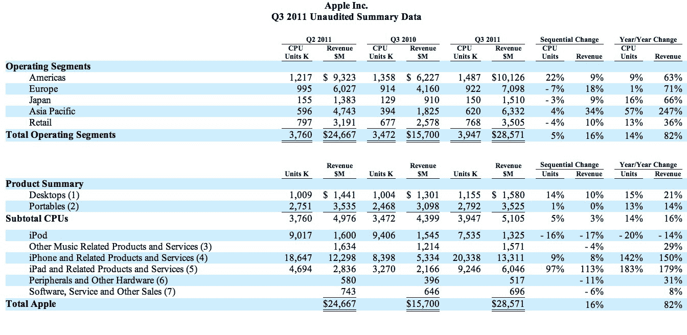

# 苹果公司的蒂姆·库克:iPad 正在蚕食一些 Mac 电脑的销售，但是“Windows 电脑要比 Mac 电脑多得多”

> 原文：<https://web.archive.org/web/http://techcrunch.com/2011/07/19/ipad-cannibalizing-pc/>

# 苹果公司的蒂姆·库克:iPad 正在蚕食 Mac 电脑的销售，但是“Windows 电脑要比 Mac 电脑多得多”

苹果刚刚宣布了又一个惊人的季度。收入增长了 82 %,达到 286 亿美元，销售了[2000 万台 iphone](https://web.archive.org/web/20230203111149/https://techcrunch.com/2011/07/19/apple-smashes-through-iphone-sales-records-once-again-sold-20-34m-last-quarter/)，但也销售了 900 万台 iPads。

iPad 的销量超过了所有其他产品。iPad 销量增长了 183%，增速甚至超过了 iPhone 销量 142%的增速。iPad 和 iPad 外设的收入达到了 60 亿美元(增长了 179%)，超过了苹果从台式电脑和笔记本电脑 Mac 电脑获得的 51 亿美元。在今天的财报电话会议上，当被问及 iPad 销售是否正在蚕食 Mac 销售时，苹果首席运营官·蒂姆·库克回应道:“一些客户选择购买 iPad 而不是 Mac，但更多的人决定购买 iPad 而不是 Windows PC。Windows PCs 要比 MAC 电脑多得多。”

他进一步阐述道:“我们在本季度售出了所有能生产的 iPad 2。需求肯定不短缺。我们在企业中也越来越受欢迎。”上个季度，苹果向 K-12 学校出售的 iPads 甚至超过了 MAC，这表明了消费者以外的需求。

对 ipad 的需求比 MAC 更大，这可以部分归因于人们在等待明天开始的 [OS X 狮子发货](https://web.archive.org/web/20230203111149/https://techcrunch.com/2011/07/19/mac-os-x-lion-launches-tomorrow/)，但是 ipad 很可能在销量和总收入上都已经永远超过了 MAC。而他们这样做仅仅是在 iPad 发布五个季度之后。

库克将 iPad 与其他平板电脑进行了比较，指出有“超过 100，000 款 iPad 专用应用”他指出，“你很难在其他平板电脑上找到超过几百个。”

由于苹果 iPads 的销量已经是 iPhones 的一半，它在平板电脑市场的领先优势看起来只会持续更长时间。

下表按产品领域和地理位置细分了苹果的销售额。

