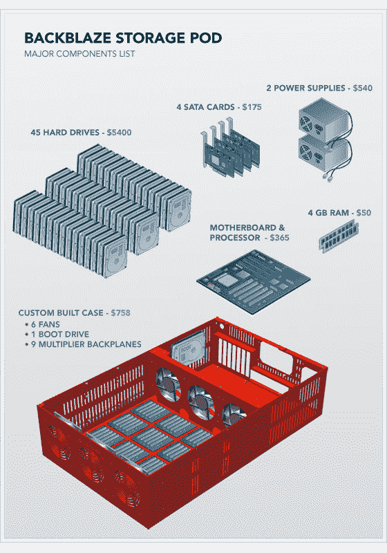

# BackBlaze 在廉价的 TechCrunch 上展示了他们的裸机、7348，135TB 的备份存储盒

> 原文：<https://web.archive.org/web/https://techcrunch.com/2011/07/20/backblaze-presents-their-bare-bones-7348-135tb-storage-pod-for-backup-on-the-cheap/>

# BackBlaze 展示了他们的裸机，7348，135TB 的廉价备份存储盒

早在 2008 年，我们就报道过 BackBlaze 基于云的备份系统[，当时 5 美元的无限存储空间听起来一定像是一份圣诞礼物。自那以后，业务已经有所成熟，但他们确定的一件事可能变得更加重要，那就是扩展硬件。随着云备份和媒体服务的全面启动，数据存储空间比以往任何时候都更有价值，提供数 TB 和数 Pb 的空间对新兴公司越来越重要。](https://web.archive.org/web/20221224144415/https://techcrunch.com/2008/06/02/backblaze-online-backup-with-time-machines-finesse/)

2009 年，BackBlaze 非常友好地让每个人都知道他们“存储舱”的绝密设计规格，他们声称这种定制服务器单元使他们的价格成为可能(首席执行官 Gleb Budman 在[的 Ignite talk](https://web.archive.org/web/20221224144415/http://vimeo.com/24750400) 中解释)。现在他们又来了。想要以远低于戴尔和惠普的价格构建自己的超低成本存储解决方案吗？[他们已经做了实地调查，并提供了一份零件分解图](https://web.archive.org/web/20221224144415/http://blog.backblaze.com/2011/07/20/petabytes-on-a-budget-v2-0revealing-more-secrets)。

以前版本中的许多项目都不再可用，这让他们和有志于云计算的爱好者都感到困难。新部件可能会在两年左右的时间内消失，但如果有什么变化的话，主要成本(驱动器)会下降，容量会增加，而其他部件(主板、RAM 等)将保持充足。

 基本布局是一个微型 ATX 服务器主板，带有常见的端口和插槽阵列。有六个 SATA 端口，但它们并不用于存储本身。相反，BackBlaze 放入了四个 PCI Express SATA 卡，然后将四个端口中的三个连接到倍增器，每个倍增器有*五个*端口——这是一个很大的数字，最终在一个案例中加起来有 45 个硬盘。系统本身有两个 760 瓦 PSU、4GB RAM 和一个 160GB 驱动器。我认为最后一点有点奢侈，并这样说，但 BackBlaze 的 Gleb Budman 向我保证，这几乎是你现在可以得到的最便宜的新驱动器(约 40 美元)。这一切都在 ProtoCase 制造的消防车红色定制箱内，这是最昂贵的组件，售价 350 美元。

一个不可避免的后果是更大规模的单元故障，但这可以通过大规模的冗余来控制，当然也有算法和绝密软件来避免这样的数据丢失。我猜如果 SATA 控制器失控(或其他什么，我不知道)，如果你采取了正确的预防措施，即使 135TB 的数据丢失也是可以管理的。这里更可能的故障(驱动器)似乎没有任何额外的风险。

拥有低成本硬件的好处是显而易见的，但我认为这不仅仅是省钱。成为你的领域的主人是有价值的:BackBlaze 以许多公司没有的方式控制着他们的硬件，他们不需要亚马逊或戴尔的支持或维护。此外，每个部分都很容易更换，他们设计了系统(这真的很简单，不说容易)，所以他们从头到尾都知道它。也许正是这种前瞻性的倾向让[差点让他们被收购](https://web.archive.org/web/20221224144415/https://techcrunch.com/2010/08/27/backblaze/)？

你可以在 BackBlaze 的博客上阅读更多的技术细节(比如文件系统变化和集群统计数据)[。我也建立了自己的系统，虽然我没有 8000 美元来复制他们的产品，但我喜欢他们的风格。](https://web.archive.org/web/20221224144415/http://blog.backblaze.com/2011/07/20/petabytes-on-a-budget-v2-0revealing-more-secrets)