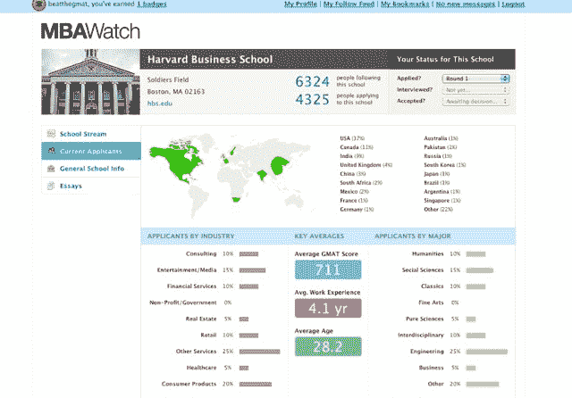

# 击败 GMAT 推出 MBA Watch，这是一个面向 MBA 的社交网络 TechCrunch

> 原文：<https://web.archive.org/web/http://techcrunch.com/2011/07/20/beat-the-gmat-mba-watch/>

# 击败 GMAT 推出 MBA Watch，这是一个面向 MBA 的社交网络

2005 年 4 月，埃里克·巴恩(当时是斯坦福大学的本科生)创建了一个博客，记录他为 Gmat 大学所做的努力。它演变成了一个普通的备考网站，每月吸引大约 200 万学生访客。今天，它推出了 [MBA Watch](https://web.archive.org/web/20230203071743/http://www.beatthegmat.com/mba/school) ，这终于让它自称的“MBA 社交网络”更加有力了

MBA Watch 试图将商学院和申请者的所有信息汇集在一个地方。MBA 希望者可以关注不同的学校，如[哈佛](https://web.archive.org/web/20230203071743/http://www.beatthegmat.com/mba/school/harvard-business-school)、[斯坦福](https://web.archive.org/web/20230203071743/http://www.beatthegmat.com/mba/school/stanford-graduate-school-of-business)或[沃顿](https://web.archive.org/web/20230203071743/http://www.beatthegmat.com/mba/school/the-wharton-school-university-of-pennsylvania)(该网站今天推出了 20 所顶级商学院)。它为每所学校创建了一面相当于脸书墙的墙，吸引官方博客帖子、脸书粉丝页面更新和关于学校的推文。你可以在官方来源和每个谈论学校的人之间切换。该网站还汇集了一般统计数据，如申请人数、GMAT 分数范围和学生人口统计数据，以及排名和文章。

在申请者方面，MBA Watch 鼓励会员分享自己的数据，这样每个人都可以看到自己的竞争对手是谁。对于每所学校，它将显示平均 GMAT 分数，平均年龄，平均工作经验年数，以及按行业和大学专业细分的快照。虽然不是每个申请 MBA 的人都会乐于分享这类信息，但很多人已经在 Beat The GMAT 的活跃论坛上分享了。有了 MBA Watch，它只是构造数据并显示总分数。

“击败 GMAT”已经吸引了一个活跃的 MBA 预科社区，它的大部分收入来自于送学生去参加正式的备考课程。它只有四名员工，今年的收入有望从去年的 50 万美元增加到 70 万至 100 万美元。而且完全是自举。“我只投入了 4 美元来购买 GMAT 6 个月的域名，”Bahn 说。他与前麦肯锡顾问戴维·帕克合作，后者拥有麻省理工学院计算机科学学位和哈佛大学法学学位，现任首席执行官。“我们俩都没上过商学院，”Park 说。

