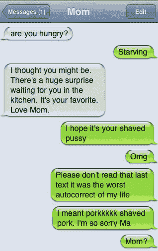

# 有史以来最流行的“该死的自动更正”的文字是...TechCrunch

> 原文：<https://web.archive.org/web/http://techcrunch.com/2011/07/20/damn-you-auto-cucumber/>

# 有史以来最流行的“该死的自动更正”的文字是…

我们之前已经[写过](https://web.archive.org/web/20230205030534/https://techcrunch.com/2010/11/04/duck-apple/)关于[该死的你自动更正](https://web.archive.org/web/20230205030534/http://damnyouautocorrect.com/10484/the-top-15-most-popular-dyac-texts-of-all-time/)，也就是因为它成功地雄辩地抓住了基于文本的沟通失败的现代时代精神。我是说这东西糟透了！就在今天早上，我发了一条 dm 给错误的人，因为 Seesmic 自动填充文本，仅仅两个小时后，我不得不删除并重新发送一条推文，因为一个打字错误。事实是我们打字越多，我们打字错误的机会就越多(你看过我的帖子吗？)围绕这些尴尬时刻的集体焦虑促成了博客[“该死的自动更正”的流行](https://web.archive.org/web/20230205030534/http://damnyouautocorrect.com/)

该死的自动更正到底有多受欢迎？自从去年 10 月推出以来，该网站已经累计获得了近 3 亿的页面浏览量，为了庆祝，该网站发布了有史以来最受欢迎的 [15 个](https://web.archive.org/web/20230205030534/http://damnyouautocorrect.com/10484/the-top-15-most-popular-dyac-texts-of-all-time/)该死的自动更正提交列表。在#1 是左边的好样本，挤掉了我个人最喜欢的在# 6 的事故。

Pophangover 首席执行官 Jillian Madison 告诉我，自 4 月 17 日发布以来，给妈妈发短信最糟糕的事情已经获得了 2622164 次浏览量。当被问及前 15 名提交的作品中有多少是假的(其中一些真的太好了，令人难以置信)时，麦迪逊回答说:“老实说，我不认为大多数是假的。当然，有些人知道这些蹩脚的文本生成器，但是我不认为普通的 DYAC 读者/提交者知道它们的存在那好吧。

Madison 说，她每天阅读 500 多份自动更正失败的提交材料，并坚持认为她可以在看到一份时分辨出假货，“你可以分辨出假货，因为字体略有不同，威瑞森模糊，气泡中的绿色更生动。”哈哈哈哈哈哈哈哈哈好吧嘿，这是生活。