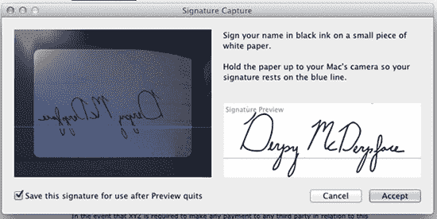
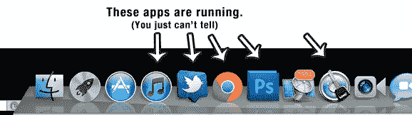
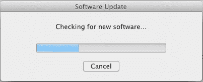
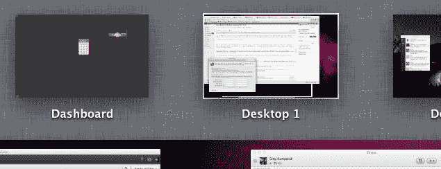
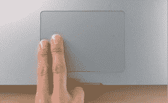

# 安装 OS X 狮子 TechCrunch 后你应该做的九件事

> 原文：<https://web.archive.org/web/http://techcrunch.com/2011/07/21/os-x-lion-new-features/>

Lion 在这里——正如 MG [用 3000 字](https://web.archive.org/web/20230205042305/https://techcrunch.com/2011/07/20/os-x-lion-upgrade/)总结的，它很棒。

然而，没有一个操作系统是完美的。至少，不是对每个人都是这样，尤其不是刚从([不存在的](https://web.archive.org/web/20230205042305/https://techcrunch.com/2011/02/25/mac-app-store-death-of-cd/))盒子里出来。为了让你的 Lion 体验*更好*，我们已经捆绑了一组提示和技巧，你真的应该在第一次进入新操作系统时准备好。

现在，要记住的是:这些建议不是放之四海而皆准的。通读列表，挑出听起来不错的，如果你有自己的建议，一定要留下评论。

# 让它安静几个小时:

昨天早上 Lion 发射后，报道开始涌入，从雪豹跳到 Lion 的人们看到了

*terribly*

呆滞的表现。然后，像变魔术一样，迟钝消失了。

原因如下:Lion 对 Spotlight 搜索的工作方式做了很多改变。这些变化似乎需要重新索引你的硬盘内容。问题？在 Lion 第一次启动后，苹果立即开始这种重新索引*,它导致系统(即使是相对较新的系统)像热垃圾一样运行，直到它完成。安装完成后，给 Spotlight 几个小时来解决所有问题，你会有一个更好的第一印象。*

 *# 在预览中签出 PDF 签名:

三年前，我把我的打印机扔进了垃圾桶。我厌倦了愚蠢的墨水，愚蠢的司机，还有那个占据我桌子空间的愚蠢的灰色盒子。从那以后我就没错过。

好的，*好的*。有一次我总是错过:每当我需要打印和签署合同的时候。由于 Lion 的预览应用程序中有一个奇特(但有些隐藏)的新功能，我再也不会错过我的打印机了。

在预览中打开 PDF。点按“注释”按钮()，然后点按“签名”按钮(，然后点击“从内建 iSight 创建签名”。将你的签名写在一张白纸上，举起来对着你的眼睛，然后*砰*:你就有了一个可以盖章的签名版本，可以预览了。打印机先生，见见垃圾桶先生。

# 反向鼠标/触摸板滚动:

通过 Lion，苹果在触摸板和鼠标上做了一个颇具争议的改变:他们逆转了这一点。任何曾经让你向上滚动的行为现在都会让你向下滚动，而向下滚动会让你向上滚动。这个想法是你现在正在移动

*content*

，而不是滚动条。鼠标向下滚动，翻页

*content*

向下移动(当滚动条向上滚动时)。

有些人喜欢它。有人讨厌它。格鲁伯[说给它一个星期](https://web.archive.org/web/20230205042305/http://daringfireball.net/linked/2011/07/20/scrollvetica)。我说管它呢——做你觉得对大脑最好的事情。我个人认为这在触控板上有意义，但在鼠标上感觉不太对——不幸的是，一个设置控制了两个*和*的方向。因为我 90%以上的时间都在使用鼠标，所以我把设置反过来了。

您可以在“系统偏好设置”>“触控板”>“滚动和缩放”下找到复选框，将滚动方向设定为您习惯的方向。寻找“滚动方向:自然”选项。

# 在正在运行的应用程序下重新启用点指示器:

这是一个奇怪的问题，因为它取决于你是升级到 Lion 还是购买一个开箱即用的运行 Lion 的新系统。

如果您升级了，正在运行的应用程序将会有您习惯在 dock 中看到的发光点指示器。如果你在一个新的狮子系统上，他们不会。随着苹果试图转向持久状态/即时启动应用设计模式，这些运行指标最终可能是不必要的。不过，就目前而言，绝大多数应用仍然是为雪豹和更早版本设计的，缺少圆点真的非常令人困惑。

您可以在“系统偏好设置”>“Dock”>“为打开的应用程序显示指示灯”下重新启用圆点

# 软件更新:

Lion 是新的 T2，但是仍然有很多东西需要更新。例如，您可能想要更新 iTunes、iLife 和 iWork，以获得它们所有新奇的全屏幕功能。只需运行屏幕左上方苹果标志下的软件更新应用程序。

# 禁用 Mission Control 中的仪表板:

Mission Control(苹果新推出的无所不包的系统视图)非常棒。以至于，事实上，“使用任务控制”将会是这里的一个技巧，但是我认为这是一个足够核心的特性，每个人都会使用它。学习手势，学习键盘热键。

不过，关于 Mission Control 有一件事有点奇怪:出于这样或那样的原因，它将你的 widget dashboard 拉进来，就好像它是一个独立的桌面/空间，如果你使用手势/热键快速从一个视图切换到另一个视图，这真的*很烦人。谁经常使用仪表板，以至于标准键(F12)不够用？*

您可以通过切换“系统偏好设置”>“Mission Control”>“将 dashboard 显示为空格”下的选项来阻止 Dashboard 出现在 Mission Control 中。

# 再给 Filevault 一次机会:

苹果的实时磁盘加密工具 Filevault 以前很烂。*很多*。如果你的 Filevault 映像中有一个小小的*位*被翻转，整个事情就会在你面前爆炸。嘭！数据不见了！这足以让很多人发誓完全放弃 Filevault，包括我自己。

好了，是时候再给 Filevault 一次机会了。苹果已经完全重建了它——事实上，以至于新版本和它的前身唯一相同的就是它的名字。新的基于全磁盘加密的设置超级快，超级安全，对你的系统性能基本没有影响。哦，它不会随机吃掉你所有的数据。

# 了解新的多点触控手势:

苹果会在你第一次启动 Lion 的时候教你如何用双指滚动，但是无数其他的手势都没有提到。一些最好的多点触控手势:

*   在页面之间滑动:用两个手指向左或向右滚动
*   在全屏应用/桌面之间滑动:用三个手指向左或向右滑动
*   访问任务控制:用三个手指向上滑动
*   显示 Launchpad(在 iOS 风格的视图中显示所有已安装的应用程序):用拇指和三个手指挤压
*   显示桌面:用拇指和三个手指展开

# 禁用自动更正:

哦，苹果。你难道没有从 iPhone 上的自动纠错中学到什么[吗？](https://web.archive.org/web/20230205042305/https://techcrunch.com/2011/07/20/damn-you-auto-cucumber/)

OS X 的可选自动更正功能似乎没有 T2 的 iOS 版那么敏感(或有趣)，但它仍不时失灵。你是一个在大男孩(或女孩)键盘上的大男孩(或女孩)。你可以打得很好。除非你经常把“teh”换成“the”，否则你可以关闭系统偏好设置下的自动更正功能>语言&文本>文本>自动更正拼写。

你认为其他人应该看到的任何提示？把它们放在评论里。*