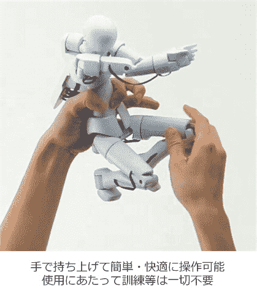

# Quma:用于 3D CG 制作的 3D 运动捕捉图(视频)

> 原文：<https://web.archive.org/web/http://techcrunch.com/2011/07/21/quma-3d-motion-capture-figure-for-3d-cg-production-video/>

# Quma:用于 3D CG 制作的 3D 运动捕捉图(视频)

总部位于日本的 SoftEther 公司开发了一个很酷的 3D 动作捕捉人物【JP】来制作 3D 电脑图形和动画。这个类似人类的娃娃被称为 Quma，全身有一系列关节，所有关节都装有传感器，用户可以自由移动:例如，举起右臂，计算机屏幕上的 3D 图形也会实时地做同样的事情。

因此，Quma 本质上是一个迷你 3D 运动捕捉设备，使设计师和工程师更容易和更直观地创建 3D CG，例如用于视频游戏、机器人应用、培训和教育模拟等。将 Quma 插入 USB 端口就足够了——不需要驱动器或外部电源。

该设备目前的形式旨在模仿人类，但 SoftEther 表示，他们的技术可以用于捕捉任何其他形状或形式的运动。

该公司表示，Quma 已经准备好投入生产，但尚未确定发布日期和价格(也有一个面向应用程序提供商的 SDK)。

此视频为行动中的图:
【YouTube = http://www . YouTube . com/watch？v = 0ny 7 XM gu 80&w = 560&h = 349】