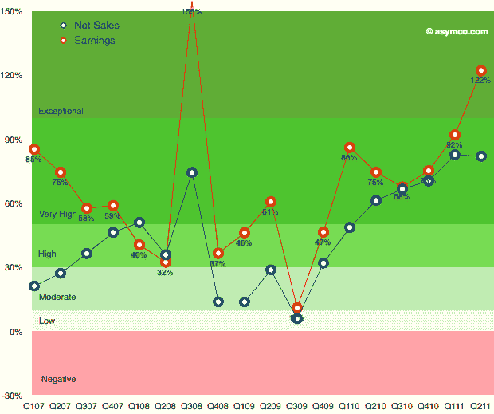

# 惊人的图表:苹果的“超季节性表现”

> 原文：<https://web.archive.org/web/http://techcrunch.com/2011/07/22/amazing-charts-apples-super-seasonal-performance/?utm_source=feedburner&utm_medium=feed&utm_campaign=Feed%3A+Techcrunch+(TechCrunch>&utm_content=Google+UK)

# 惊人的图表:苹果的“超季节表现”

是的，苹果有一个巨大的季度。但是到底有多重要呢？这张来自 [Asymco](https://web.archive.org/web/20230203121333/http://www.asymco.com/2011/07/20/apples-growth-scorecard-for-second-quarter-2011/) 的图表展示了苹果令人难以置信的收入增长。苹果上个季度的收入增长了 82%，对于一个季度收入 286 亿美元的公司来说，这是前所未有的增长。

从图表中可以看出，几乎所有的销售增长都来自 iPhone(灰色)和 iPad(蓝色)。事实上，现在苹果 71%的销售额和 78%的利润来自 iOS 设备。仅 iPad 一项就在蚕食苹果电脑的销售。

但是仔细看看这张图表。真正令人震惊的是，在过去的 6 年里，第二季度的销售额首次超过了第四季度的假日销售额。每隔一个高峰都是在假期，但苹果新的触摸计算产品类别的增长帮助推动销售超过那个“超季节性表现”，正如 Horace Dediu 在 Asymco 上所说。

我们都在谈论“井喷”季度，但这里确实发生了前所未有的事情。苹果的增长正在加速。下图显示了过去 7 个季度销售额和净收入的快速增长。销售额增长了 82 %,利润增长更快，达到 122%。你会期望看到一个利润只有几百万美元的小初创公司有这样的增长，而不是一个利润 73 亿美元的科技巨头。与前一年相比，苹果仅利润就增加了 40 亿美元。

正如 Idealab 的[比尔·格罗斯问道的那样，](https://web.archive.org/web/20230203121333/https://plus.google.com/100612175927429294541/posts/8ZUUReKKU47)“历史上有没有这么大的一家公司，在短短一年内增长了这么大的百分比？”

