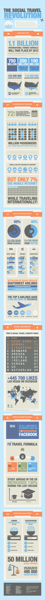

# 在脸书的美国人比有护照的还多 TechCrunch

> 原文：<https://web.archive.org/web/http://techcrunch.com/2011/07/22/more-americans-are-on-facebook-than-have-a-passport/?utm_source=feedburner&utm_medium=email&utm_campaign=Feed%3A+Techcrunch+(TechCrunch>)

# 在脸书的美国人比有护照的还多

为了庆祝我在八月最后两周的假期已经被正式确认了。)，我在此发布我所见过的最大的信息图:“社交旅行革命”，由仍在测试阶段的旅行初创公司 [Tripl](https://web.archive.org/web/20230205034058/http://tripl.com/) 的人带给你。

**最令人震惊的统计:** 50%的美国人在脸书(1.55 亿)，而只有 37%的美国人有护照(1.15 亿)。值得称赞的是，脸书的入职流程更加精简。

