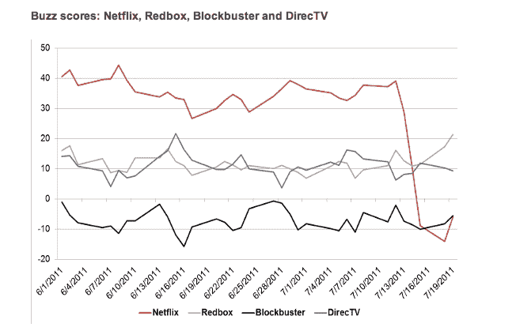

# 哎哟:网飞价格变化的后遗症 TechCrunch

> 原文：<https://web.archive.org/web/http://techcrunch.com/2011/07/22/ouch-the-netflix-price-change-hangover/>

看着网飞从一家在 2000 年被 Blockbuster [嘲笑的公司](https://web.archive.org/web/20230203071945/http://tusb.stanford.edu/2008/01/barry_mccarthy_chief_financial.html)(当时创始人兼首席执行官雷德·哈斯汀斯和前首席财务官 Barry McCarthy 向 Blockbuster 管理层提议他们运营其在线品牌)成长为 2011 年北美网络流量最大的单一来源的[是一件非常有趣的事情。](https://web.archive.org/web/20230203071945/https://techcrunch.com/2011/05/17/netflix-largest-internet-traffic/)

在这一过程中，有不少打嗝和起伏，因为点播视频提供商[与好莱坞工作室](https://web.archive.org/web/20230203071945/http://www.businessweek.com/magazine/content/10_02/b4162054151330.htm)斗争，随着领导层将其服务推向电视、游戏系统和移动设备而取得成功——最近，又重新专注于流媒体业务。

上周，这种商业模式的调整导致服务定价结构的公开修改，这是网飞急切地将其 DVD 租赁和流媒体服务分成两项不同业务的结果。此外，网飞为其 DVD 业务建立了一个完全独立的管理团队，同时宣布将提供 7.99 美元的流媒体计划和 7.99 美元的 DVD 计划，因此想要两者的客户现在必须每月支付 16 美元——比之前的计划选项价格上涨了 60%。(对于同时选择流和实体的人。)

而且，你可能已经听说了，顾客不高兴。不，他们一点也不快乐。事实上，在网飞[宣布上述价格变化](https://web.archive.org/web/20230203071945/http://blog.netflix.com/2011/07/netflix-introduces-new-plans-and.html)的博客帖子上，有超过 12，000 条评论被发布(这是使用脸书的评论系统，TechCrunch 的读者很不高兴地熟悉这一系统)，其中大多数人很愤怒，许多人反过来自己宣布，他们将提交辞呈，立即生效。

当然，但是，那又怎样？嗯，[根据 YouGov 的 BrandIndex](https://web.archive.org/web/20230203071945/http://www.brandindex.com/article/sharp-drop-netflix-after-price-changes) ，在网飞调整价格后的十天里，网飞品牌在成年人中的全国认知度从 7 月 12 日的 39.1 急剧下降到 7 月 18 日的-14.1，目前位于-6，使网飞与百视达几乎持平。5%的误差，这可不是小偏差。

BrandIndex 通过询问网飞、Redbox、DirecTV 和 Blockbuster 的客户对每个品牌的印象以及他们通过口碑、广告等对该品牌的了解来计算得分。BrandIndex 全球董事总经理 Ted Marzili 告诉我，这些分数反映了大约 15，000 名受访者的样本规模。注意，下图。

当然，没过多久， [Blockbuster 就用 30 天的免费试用期来讨好](https://web.archive.org/web/20230203071945/http://www.reuters.com/article/2011/07/14/idUS190794536420110714)潜在的网飞叛逃者。尽管 Blockbuster 似乎没有从网飞的改变中获得丰厚的回报，但该公司的股票在过去两年中表现非常好(在 7 月 13 日宣布之前处于 6 个月的高点)，此后下跌了 20 多点。有些是自然的——股票应该下跌——当然有些不是。

据 GigaOM 报道，摩根士丹利也介入了它自己的网飞调查，该调查发现，事实上，26%的网飞客户将完全取消他们的订阅。随着最初的情绪焦虑逐渐消退，这些数字已经有所下降，但无论如何，网飞在不久的将来都有可能在订阅收入方面遭受损失。

网飞现在已经迫使它的许多客户在流媒体和 DVD 之间做出选择，因为，毕竟，正如雷德·哈斯汀斯本人在 5 月份告诉 Erick Schonfeld 的那样，未来在于流媒体，而不是塑料光盘。我是说谁还会用 CD，你知道吗？

当一项主要服务提价时，总会有反弹，但看起来网飞可能会事先进行更多的市场调查，如果它给现有用户某种形式的激励，而不是新用户，无论是通过一年期计划的折扣还是其他方式，都可能是明智的。(并且反过来表现出对忠实顾客的一点体谅。)

买一送一的折扣怎么样？毕竟，我们生活在日常交易的时代，消费者似乎期待打折。更不用说在过去的两年里，许多人的钱包都经历了严重的缩水。资金比公司早期更加紧张，网飞可能会从承认这一点中受益。

我们将看到这一切如何发展。我预计网飞的品牌认知度和股票不久就会重回正轨，但宿醉仍有可能继续。或许更重要的是——不要笑——百视达真的会因此受益吗？Redbox 怎么样？当地图书馆？

你的想法？