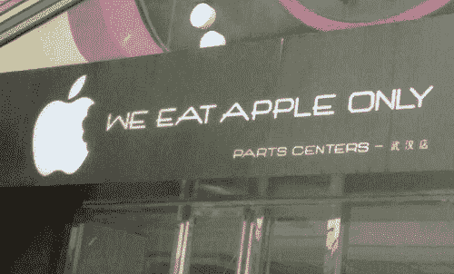
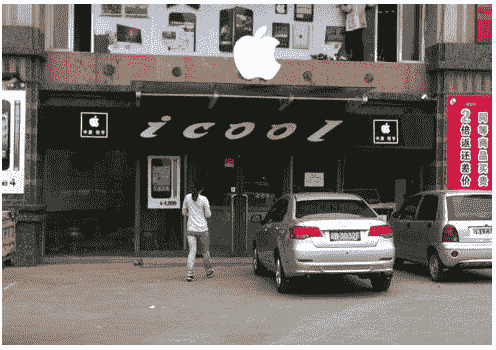

# 物种的多样性:山寨苹果商店在中国比比皆是

> 原文：<https://web.archive.org/web/http://techcrunch.com/2011/07/22/the-variegation-of-the-species-fake-apple-stores-abound-in-china/>

# 物种的多样性:假冒苹果商店在中国比比皆是

在中国昆明发现一家假冒苹果商店后，引起了博客圈的关注， [MICGadget](https://web.archive.org/web/20230203091501/http://micgadget.com/13872/there-are-lots-of-fake-apple-stores-across-china/) 挑选了一些近年来出现的更令人印象深刻的假货，也许最终会出现一个类似 Giger 的蛋盒版本，里面装满了 iPhones、MAC 和(尽管不是出售的) [iPad 2](https://web.archive.org/web/20230203091501/https://techcrunch.com/tag/ipad) 。

很明显，昆明商店的老板曾经是苹果的授权经销商，直到他哄抬价格，丢掉了执照。现在，他销售灰色市场的硬件，并从苹果经销商门户网站获取所有营销宣传资料。

苹果在零售领域的成功和受欢迎程度是它在中国的祸根，很明显，苹果正在为其未能及早抢占这块大陆而付出代价(尽管很明显[他们正在弥补失去的时间](https://web.archive.org/web/20230203091501/https://techcrunch.com/2011/07/19/apples-tim-cook-china-was-very-key-to-our-results/))。我怀疑，销售服装、设计和商标侵权方面的公然盗版并不是问题的一半。事实上，我的支持和售后活动是这些商店最大的问题，但众所周知，如果你致力于一个品牌，你会尽一切努力抓住最新的装备。虽然你可以在北京和上海找到苹果专卖店，但在昆明可能很难找到，除非有人用木制家具和支腿来搭建。

然而，这些山寨店会给那些可能不熟悉 Mac“魔力”的人更多一点的体验，只要他们不卖彻头彻尾的假货，这可能不会伤害苹果的底线。此外，刻薄的游客在 iCool 商店前拍照总是很有趣。

