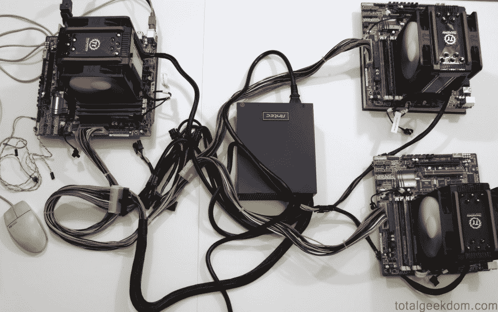
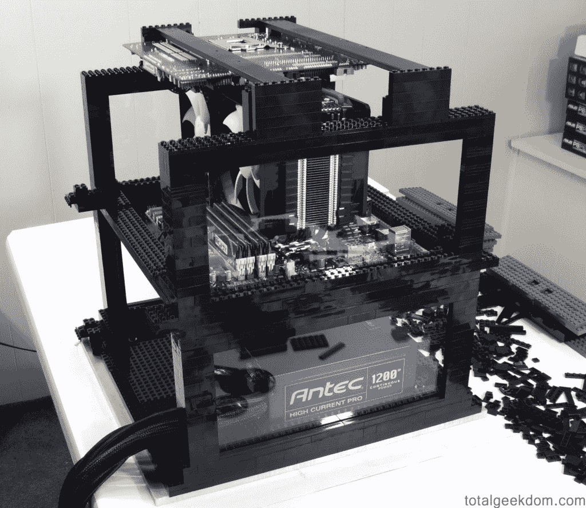
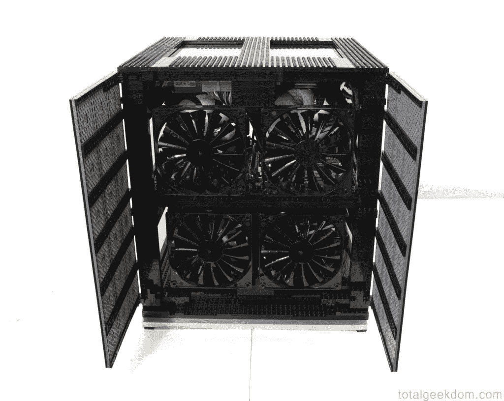

# 乐高盒装电脑高效运转是有原因的

> 原文：<https://web.archive.org/web/http://techcrunch.com/2011/07/23/lego-computer-crunches-efficiently/>

# 乐高盒装电脑高效运转是有原因的

对许多人来说，用乐高积木搭建会带来美好的回忆。对于迈克·施洛普来说，记忆仍在构建中。Schropp 热爱乐高，经常将它们融入科技。在他的最新项目中，Schropp 使用大约 2000 块黑色乐高积木设计了一个 12 核 PC，并将其放入定制的机箱中。成品不仅看起来很棒，而且节能。

Schropp 有兴趣建造一台机器，它可以为社区网格贡献一些计算能力，帮助处理数据以解决医疗挑战。他原本打算从头开始制造一台机器，但认为在家里增加第四台电脑似乎有些过分。

相反，Schropp 挑战自己，通过将他最好的机器组合到一个超级盒子中来优化和加速他现有的设置。他希望在零部件上花费不超过 2000 美元，并建造一台每天可以处理 10 万个“点”的机器，向[世界社区网格](https://web.archive.org/web/20230325060121/http://www.worldcommunitygrid.org/)。由于该机器旨在全天候运转，因此能效在设计过程中尤为重要。

在他收集的乐高积木的帮助下，Schropp 将三台电脑合二为一。成品包含三个 CPU、冷却器、主板、固态硬盘、DDR3 内存和八个风扇。该装置仅依靠一个电源运行，Schropp 将其修改为为所有三个系统供电。Schropp 设计了 Lego 机箱，以允许 CPU 和主板之间尽可能多的气流。

通过新的巨型盒子，Schropp 的“折叠农场”为人道主义和医学研究做出了贡献，使用的电力比三个独立运行的盒子的总和还要少。

三合一机箱每天消耗大约 670 瓦的功率来处理大约 135，000 个点，相比之下，只有一台 Schropp 的旧工作站 PC 每天使用 350 瓦来处理近 10，000 个点。即便如此，电力供应仍大于系统所需，预计未来还会增加一个等级。

*迈克·施洛普的照片[极客世界](https://web.archive.org/web/20230325060121/http://www.totalgeekdom.com/)*