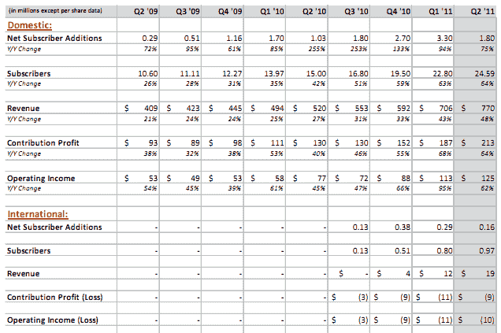

# 盘后忧郁:网飞股票下跌 10 %,警告增长放缓

> 原文：<https://web.archive.org/web/http://techcrunch.com/2011/07/25/after-hours-blues-netflix-stock-falls-10-percent-on-warnings-of-slower-growth/>

上周五，[我写了一篇帖子](https://web.archive.org/web/20230328221930/https://techcrunch.com/2011/07/22/ouch-the-netflix-price-change-hangover/)，讲述网飞[最近的价格变化](https://web.archive.org/web/20230328221930/https://techcrunch.com/2011/07/12/netflix-dvd-only/)如何对该公司及其品牌的认知度产生了明显的(负面)影响。一场有趣的对话在评论区展开，一些人解释为什么他们取消了网飞订阅，一些人甚至认为这是一场“公关噩梦”。

在今天下午的 Q2 财报电话会议上，网飞创始人兼首席执行官雷德·哈斯汀斯表示，该公司改变定价的决定并不幼稚，确实预计会受到一些强烈反对。当然，正如黑斯廷斯所说，*“像任何客户驱动的组织一样，我们对客户感到不安感到很难过”*。

不管怎样，投资者似乎并不那么乐观。在撰写本文时，网飞股票在盘后交易中暴跌超过 28 美元，整体跌幅达 10%。虽然网飞公布了另一个强劲的季度，净收入高达 6800 万美元，同比增长 55%，收入为 7.886 亿美元，同比增长 52%，但也有一些警告。[正如我的同事 Erick Schonfeld 今天下午早些时候写的](https://web.archive.org/web/20230328221930/https://techcrunch.com/2011/07/25/netflix-75-percent-new-customers-streaming/),*“华尔街仍然对第三季度的放缓感到不满”*。这是为什么呢？

网飞估计，网飞备受关注的价格变化将于第三季度生效，并于 9 月 15 日全面铺开。因此，网飞预计*“第三季度国内净增长将低于去年第三季度，由于价格变化的时间，收入将仅略有增长”。这意味着:投资者，降低你对未来几个月的预期。(或者，正如我们从今天下午的活动中看到的，“像被偷一样卖掉它”。)*

网飞不太乐观的预测的另外几个可能原因可能在于内容成本正在上升，加上随着网飞转向更多的流媒体内容，每次订阅的收入下降，以及扩大其国际业务的成本(它计划在今年晚些时候扩展到拉丁美洲)，可能会让一些分析师感到紧张。网飞将下一季度的每股收益预期从本季度的 1.26 美元下调至 0.72 美元至 1.07 美元，这也于事无补。

在今天的收益电话会议上，雷德·哈斯汀斯说“DVD 的寿命将比人们想象的更长更长”。另一方面，根据其致股东的信，*“随着流媒体的快速采用，网飞的 DVD 出货量可能已经见顶”。*通过创建一个独立的管理团队和 DVD 业务，该公司希望这些圆形光盘的生命将继续下去，但这似乎标志着末日的开始。

因为网飞的流媒体业务最终确立，该公司有能力鼓励其客户转向流媒体，而价格变化是实现这一目标的最佳催化剂。

此外，为了鼓励这种转变，网飞可以从不必为 DVD 支付相同水平的运输成本中节省下来，并将其投入流媒体。当然，网飞在中断方面遇到了一些问题，各方都意识到，与 DVD 相比，它的流媒体库并不具备同样的广度。因此，在这一点上，开始向其基础设施分配更多资金并开发其流媒体内容的需求是最重要的。预计明年网飞的流媒体内容会有重大更新，或者观看客户跳槽。

说到这个，网飞也对据报道已经摆在桌面上的梦工厂的潜在交易保持沉默。虽然黑斯廷斯没有说是否已经达成协议，但他也没有否认对话正在进行中。

由于所有这些变化以及与潜在流媒体内容合作伙伴的持续讨论，该公司表示不打算“竞购 Hulu”也就不足为奇了。目前，专注于当前电视季的广告支持的免费内容还不是网飞景观的一部分，尽管毫无疑问，该公司将继续关注亚马逊 Prime 和 Hulu Plus，特别是当 Hulu 的潜在未来买家决定如何处理其订阅服务时。苹果、谷歌和微软都已经开始尝试 Hulu，但仍不确定该公司最终会走向何方。

尽管如此，网飞在第二季度在美国增加了 180 万用户，与去年第二季度相比增长了 75%，使其用户总数达到 2460 万，比 2010 年 Q2 增长了 64%。此外，75%的新用户注册了网飞的纯流媒体服务。

显然，黑斯廷斯和他的公司相信，其流媒体业务有足够好的信誉，这是开始加速从 DVD 向流媒体过渡的最佳时机。Hastings 表示，他预计到第三季度末，网飞将拥有 2200 万流媒体用户，美国用户总数将达到 2500 万，这意味着该公司预计下一季度只会再增加 40 万左右的用户。从大的方面来看，这可能只是雷达上的一个光点，这完全取决于客户到底有多不高兴，以及对竞争可行性的感知。

有关网飞财务状况的更多信息，请点击此处，并查看下面的图表进行快速浏览:

