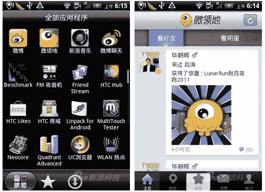

# HTC Status/Salsa 脸书手机作为 HTC 威客新浪微博手机 TechCrunch 登陆中国

> 原文：<https://web.archive.org/web/https://techcrunch.com/2011/07/25/the-htc-statussalsa-facebook-phone-lands-in-china-as-the-htc-weike-sina-weibo-phone/>

# HTC Status/Salsa 脸书手机作为 HTC 威客新浪微博手机登陆中国

脸书是世界上最大的社交网站。但在中国不是。脸书和推特被中国的防火长城屏蔽了。微博服务新浪微博是中国的鞭子。HTC 了解自己的市场，因此略微调整了中国市场的[状态/Salsa](https://web.archive.org/web/20230203071407/https://techcrunch.com/2011/07/11/htc-status-goes-up-for-pre-order-on-att-2/) 。脸书的标志不见了，取而代之的是专用按钮上的微博燃眼标志。

手机的其他部分似乎没有变化。它在姜饼和 800MHz CPU 上运行 HTC Sense 2.1。有一个 3.4 英寸 480 x 320 的屏幕，铝制机身和一个 500 万像素的摄像头。HTC 只是为不同的市场改变了一个小按钮。

当然，由于紧密的脸书集成被同样紧密的微博集成所取代，操作系统内部也有一些不同。微博服务被嵌入到手机的许多应用程序中。当然，硬件是品牌重塑，但手机是为新浪微博打造的。[[SinaTech](https://web.archive.org/web/20230203071407/http://micgadget.com/goto/http://tech.sina.com.cn/mobile/n/2011-07-21/14265816295.shtml)via[mic gadget](https://web.archive.org/web/20230203071407/http://micgadget.com/13979/htc-launch-weibo-phone-in-china-video/)

