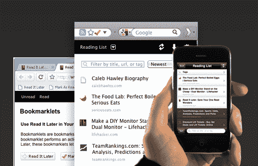

# Read It Later 筹集了 250 万美元，希望成为内容的 Dropbox TechCrunch

> 原文：<https://web.archive.org/web/http://techcrunch.com/2011/07/26/read-it-later-raises-2-5-million-wants-to-become-the-dropbox-of-content/>

[Read It Later](https://web.archive.org/web/20230205025506/http://www.readitlater.com/) 是一项广受欢迎的服务，可以让你将网页加入书签，然后从任何智能手机、电脑或平板电脑上访问它，该服务已经筹集了 250 万美元的资金。这轮融资标志着该公司的第一次外部融资，包括来自基金会资本(该轮融资的领导者)、Baseline Ventures、谷歌风险投资、方正集体和几家天使投资者的投资。

RIL 创始人内森·韦纳最初在 2007 年 8 月创办了这家公司，直到今年年初，他是唯一一个为公司工作的人——在此期间，他建立了网络产品、多个移动应用程序和数百万用户群。随着服务的起飞，韦纳搬到了硅谷，在那里他收到了多个收购要约，但决定保持公司独立。他还开始扩大团队，现在已经有五个人了。

韦纳希望 RIL“为网络内容做 Tivo 为电视内容做的事情”，在某种意义上，这让他们可以在他们想要的时候消费他们想要的东西。他说，Read It Later 也有一个类似 Drobox 的使命:它希望让你可以在你的任何设备上访问这些内容，无论是手机、平板电脑、电视还是电脑，而不必考虑你在哪里保存了什么。

在这一点上，Read It Later 显然专注于书面内容，但人们已经开始使用它来标记其他内容——事实上，Read It Later 上保存最多的网址是 YouTube。

韦纳说，这项服务目前共有 350 万注册用户(尽管这还包括不活跃的用户)。它表现出强劲的增长，每天有 10，000 次下载，超过 250 个应用程序(包括 Twitter 的官方应用程序)集成了 RIL API。你可以在这里看到这些应用[的目录。](https://web.archive.org/web/20230205025506/http://readitlaterlist.com/apps)

当然，Read It Later 并不是唯一可以让你在设备间同步书签的服务。 [Instapaper](https://web.archive.org/web/20230205025506/http://www.instapaper.com/) 得到了科技媒体的大量关注(部分原因是它由 Tumblr 的前首席开发者 Marco Arment 运营，部分原因是它做得非常好)。但是韦纳说，Read It Later 实际上在 Instapaper 之前就已经开始了，它的用户群大约是 Instapaper 的两倍。他还指出，Instapaper 主要迎合 iOS 用户，而 Read It 后来在更多平台上提供官方应用程序(尽管 Instapaper it 确实有 API，所以其他平台也有非官方应用程序)。

还有苹果公司，它在最新版本的 Safari 中推出了一个名为“阅读列表”的功能，其中包括许多相同的功能。韦纳对此并不担心——他说苹果用户是孤立的，同时使用 iOS 和 Safari 的 RIL 用户不到 RIL 用户的 1%。

