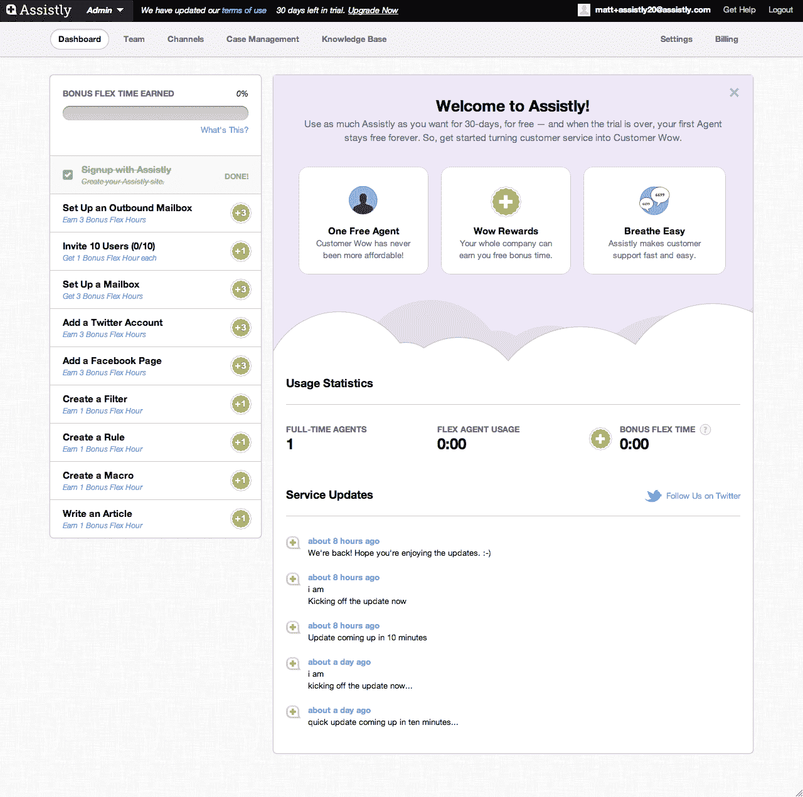

# 借助 v2.0，Assistly 为客户服务软件 TechCrunch 带来了简单的定价模式、奖励和一点免费

> 原文：<https://web.archive.org/web/http://techcrunch.com/2011/07/26/with-v2-0-assistly-brings-a-simple-pricing-model-rewards-and-a-bit-of-free-to-customer-service-software/>

[Assistly](https://web.archive.org/web/20230203074904/http://www.assistly.com/) ，一个基于云的客户支持平台，[在今年 1 月](https://web.archive.org/web/20230203074904/https://techcrunch.com/2011/01/04/assistly-scores-3-million-more-for-fast-growing-saas-customer-service-product/)从[牛棚资本](https://web.archive.org/web/20230203074904/http://www.crunchbase.com/financial-organization/bullpen-capital)、[指数风险投资](https://web.archive.org/web/20230203074904/http://www.crunchbase.com/financial-organization/index-ventures)、Salesforce，以及其他几个天使和风投那里筹集了 300 万美元的资金。

自去年 9 月推出并获得新资本以来，Assistly 已经吸引了 Yelp、Etsy、37signals、Pandora、Vimeo 和 Spotify 等公司作为付费客户，通过客户支持平台吸引他们，该平台允许企业通过利用脸书、Twitter 和其他社交网站上的社交媒体对话，在电子邮件和电话等传统客户服务途径之外回应客户。马克·库班和刘中达是这家初创公司的顾问，这也很有帮助。

除了能够监控许多不同渠道上的客户聊天之外，Assistly 还使企业能够过滤这些对话，将它们组织到优先的、可操作的列表中，以及访问客户历史记录，自动化所有这些支持流程，并查看指标和分析。

Assistly 的另一大卖点是其定价模式，其中包括一个“灵活”的定价模式，允许用户为非全职代理(如高管、开发人员、营销人员等)购买使用时间。)，能够免费创建额外的弹性座位。

然而，自推出以来，就像一个好的客户支持创业公司一样，Assistly 一直在听取自己的客户反馈，它认为它找到了一个更有吸引力的定价结构。毕竟，没有比“免费”更吸引人的词了。

如今，Assistly 正在推出一种新的定价模式，包括免费的全功能版服务，以及 SaaS 软件的 2.0 版本。Assistly 联合创始人兼首席执行官 Alex Bard 告诉我们，最初的定价模式是“你已经见过数百次的熟悉的 SaaS 模式”，它是三层的(标准、专业和企业)，每一层都增加了更多的功能，但同时每个座位的价格也越来越高。

更新背后的想法是摆脱提供“一个蹒跚的免费增值模式”。客户告诉这家初创公司，他们希望从免费服务开始，然后随着自身的发展以低廉的成本增长。此外，客户不喜欢分层定价结构；他们希望在需要时购买他们需要的东西，而不是以后被迫升级。简而言之，他们想要一个简单、易懂、透明的价格体系，并且希望能够改变他们的想法。

虽然这听起来要求很多，Assistly 认为这是一个很好的解决方案。第一个全职代理对每个助理客户都是免费的，企业可以免费添加任意数量的“灵活代理”，实际使用时每小时只需支付 1 美元，并且完全取消了分层定价。辅助添加的廉价“照单点菜”升级，用户可以随时添加或删除它们。

该团队还继承了所有现有客户，对其进行了调整，以便为他们提供新老产品的最佳组合。据巴德说，没有一个顾客的价格上涨。这听起来像是网飞可以从 Assistly 的书中吸取经验。

在另一个独特的转折中，这家初创公司让客户能够获得额外的弹性工作时间作为奖励(它称之为 Assistly Wow Rewards)，他们只需使用这项服务即可获得。因此，这意味着企业通常采取的行动可以为他们赢得积分，并降低运行服务的总体成本。例如，如果一家企业将其 Twitter 帐户与 Assistly 连接，它可能会获得 3 小时的免费支持。

除了新的定价设置和奖励，Assistly v2.0 还重新设计了其入职、管理和报告界面，获得了更直观的外观和感觉，以及对工作流的额外支持。

这些都是对 SaaS CRM 平台的很好的补充，并使 Assistly 成为更易于使用和负担得起的平台之一。看看顾客是否会有同样的反应会很有趣。

有关新定价结构的更多信息，请点击[此处](https://web.archive.org/web/20230203074904/http://www.assistly.com/pricing/)。

