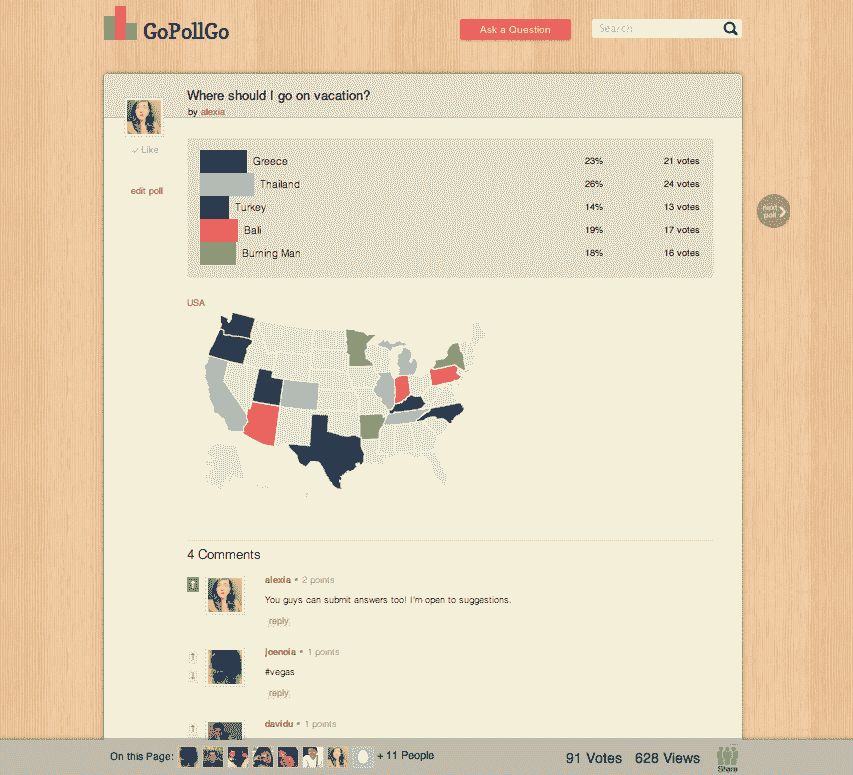

# 民意调查初创公司 Gopollgo 利用实时分析进行重新设计，从 ideal ab tech crunch 筹集了 32.5 万美元

> 原文：<https://web.archive.org/web/http://techcrunch.com/2011/07/27/polling-startup-gopollgo-redesigns-with-realtime-analytics/>

# 民意调查初创公司 Gopollgo 利用实时分析进行重新设计，从 Idealab 筹集了 32.5 万美元

投票站 [Gopollgo](https://web.archive.org/web/20230203084757/http://www.gopollgo.com/) 最近关闭了一轮来自[Identirab](https://web.archive.org/web/20230203084757/http://www.idealab.com/)的 32.5 万美元种子资金，此外还推出了一项产品和网站更新，重点是从推特关注者那里收集更多的见解。

有了新的木质面板的 Gopollgo 网站，用户可以在几秒钟内构建和定制投票，轻松将其发送到 Twitter 并观看 Gopollgo 为投票提供实时分析和位置细化数据。

例如:我花了大约 10 秒钟来建造[这个“我应该去哪里度假？”民意测验](https://web.archive.org/web/20230203084757/http://gopollgo.com/where-should-i-go-on-vacation)我现在很开心地看着谁在页面上(为什么你不在工作[安迪·布雷特](https://web.archive.org/web/20230203084757/http://www.crunchbase.com/person/andy-brett)？！)，有多少人投票(106 票)，该民意测验被浏览了多少次(693 次)。看着选票被一个州一个州分开来也是非常令人惊讶的——似乎加利福尼亚州很喜欢我去燃烧的人*平息惊讶*。

“想象一下，一个大品牌也在做同样的事情，并立即获得信息。超级强大，”Gopollgo 的联合创始人(也是前 TechCrunch 开发者)本·夏切特(Ben Schaechter)在我向他转达这是多么酷的时候告诉我。自他实施实时分析功能以来，该网站每次访问的注册用户达到 25 次，推特用户平均在该网站上停留 8 分钟。

Schaecther 计划利用新的资金雇用更多的工程师(该团队目前是四人小组),并计划通过提供合作交易和优质功能(如页面品牌)最终将产品货币化。

