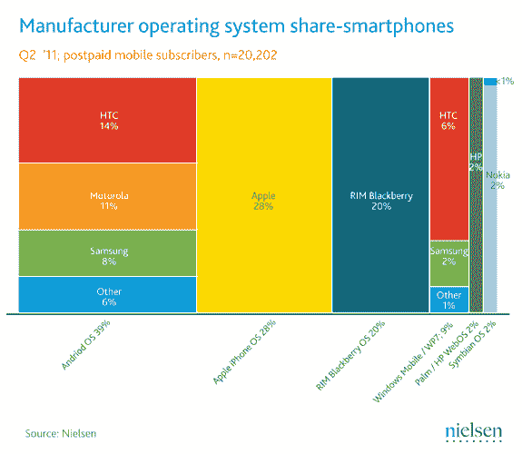

# 尼尔森:安卓占据操作系统榜首，苹果领先制造商 TechCrunch

> 原文：<https://web.archive.org/web/http://techcrunch.com/2011/07/28/nielsen-android-takes-top-os-spot-apple-tops-manufacturers/>

# 尼尔森:安卓占据操作系统榜首，苹果领先制造商

尼尔森今天给绿色小机器人的爱好者带来了好消息:截至今年 6 月，安卓已经占据了美国智能手机操作系统市场的头把交椅。数据显示它占据了 39%的市场份额，其最接近的竞争对手苹果以 28%的份额远远落后于它。哦，让我们不要忘记黑莓操作系统，它目前拖了 20%的后腿。排在最后的是 Windows Phone 7，市场份额为 9%，考虑到它的竞争对手享有的领先优势，这是一个小小的成就，还有 WebOS 和 Symbian(市场份额均为 2%)。

鉴于诺基亚智能手机在美国的极度匮乏，这让我感到有点困惑。两年前，E71x 低调地在美国电话电报公司首次亮相，甚至新推出的诺基亚 Astound 也似乎已经从 T-Mobile 的在线商店中消失了。当然，形势仍在不断变化；随着惠普希望 TouchPad 将利用 Veer 4G 和即将推出的 Pre 3 的销售，我们很可能会在下一轮看到排名的提升。不过，他们需要非常非常小心地进行下一步。

在硬件方面，苹果表明他们不会屈居第二。他们成功地为自己赢得了顶级制造商的称号——公平地说，这是一场轻而易举的胜利。考虑到顶级操作系统找到了 HTC、摩托罗拉和三星制造的设备，苹果从一开始就是一把锁。令人惊讶的是，RIM 发现自己与 HTC 并列制造了人们口袋中 20%的智能手机，我们或许可以将这归因于企业支持平衡了 HTC 的消费者广告活动。

这些结果都很好，我相信它们会被引用一段时间，但它们正处于变革的风口浪尖。我很想知道一旦 Galaxy S II 系列和 iPhone 4S/5/等重磅产品发布，情况会如何变化，我们一定会让你知道。

