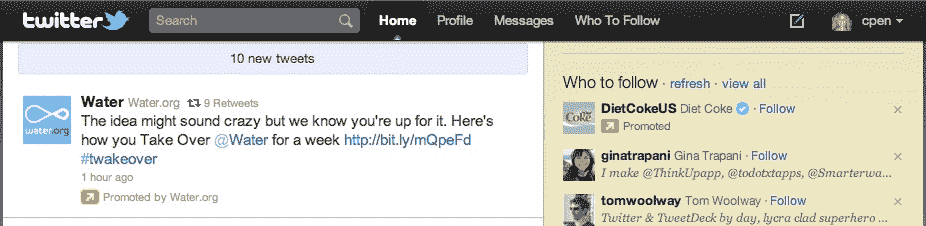

# Twitter 的 Adam Bain Talks 在时间线中推广推文——为什么你会看到它们，为什么你会喜欢它

> 原文：<https://web.archive.org/web/http://techcrunch.com/2011/07/28/show-twitter-the-money/>

今天早些时候，Twitter 正式宣布[你可以开始在你的主 Twitter 时间轴](https://web.archive.org/web/20230306111047/https://techcrunch.com/2011/07/28/promoted-tweets-in-stream/)中看到推广的推文。换句话说，广告将首次以真正重要的方式进入信息流。随着这一消息在过去几周开始慢慢传出，有人[担心](https://web.archive.org/web/20230306111047/https://techcrunch.com/2011/06/23/in-stream-ads-are-coming-to-twitter-will-a-user-revolt-follow/)这可能会引起用户反弹。但是推特全球收入负责人[亚当·贝恩](https://web.archive.org/web/20230306111047/http://www.crunchbase.com/person/adam-bain)完全不这么看。事实上，他认为这将是品牌和用户的双赢。公告发布后不久，我们有机会与贝恩进行了交谈。

“随着 Twitter 的发展，公司蜂拥而至，这不是什么秘密，”贝恩说，并指出营销人员和品牌几乎从第一天起就已经在那里了。“我们发现，20%到 40%的用户在 Twitter 上关注一个或多个品牌，”他继续说道，并指出这一点极其重要(这一统计是基于第三方研究，因为“品牌”的定义各不相同，所以范围如此之广)。“当品牌有更新或独家内容时，用户希望得到更新。他说:“我们从用户那里听到的一个问题是，当有独家内容或交易时，他们可能会错过。”“如果品牌在上午 9 点发推，而用户在上午 9 点 15 分进来，他们会想念他们。”

因此，在时间线推广推文。

贝恩指出，这一新概念的运作方式与推广推文在 Twitter 搜索中的运作方式相同。“我们知道这对用户有效，对品牌也有效，”他说。然后，他一口气说出了一些他们已经签约作为发布伙伴的大品牌:戴尔、HBO、Summit Entertainment、红牛、丝芙兰等等。

“一如既往，推广的推文将与消费者相关。贝恩表示:“你已经追随了这个品牌。

好吧，这一切都有道理，听起来不错。但很明显，这是 Twitter 货币化的最大进步。

按照这些思路，我向贝恩咨询了这款产品的定价。他说，虽然他不能谈论具体的定价，但这是 Twitter 上其他推广产品遵循的相同模式。也就是说，这是一个“竞价”市场。大约一年来，Twitter 一直在搜索和其他一些地方完善这种模式，并意识到按参与度付费的模式在这项服务上运行良好。如果一个品牌发布了一条推广推文，Twitter 只有在广告有参与度的情况下才能收费。这意味着 Twitter 只有在有人点击、转发或收藏推广的推文时才赚钱。贝恩说，大多数互动实际上都是点击。

贝恩表示:“事实证明，在 Twitter 上，用户与广告的互动已经达到了令大多数人感到惊讶的程度。”。他指出，虽然传统的在线展示广告的点击率只有 0.05%左右，但一些推广的推文的参与度达到了两位数的百分比。“参与很重要，”贝恩说。

这对 Twitter 真的很重要。因为如果广告没有被占用，Twitter 有权删除它们。对于用户来说，还有一种更明确的方式来表示他们不想看到广告:简单地“X”掉它，它就会从时间线中消失。“我们使用许多信号来衡量和理解相关性，”贝恩说。

“共鸣对我们来说也非常重要。这是关于实时机会。贝恩继续说，在理想的情况下，品牌在推特上发布的东西将是“好的，而不是响亮的”。

贝恩表示，产品的实时性对于 Twitter 如何放置他们也至关重要。因为人们在推特上谈论的热门话题可能在任何时候发生，所以推特需要能够与一个品牌对话，并迅速发布适当的推文。“这是大规模的实时营销，”他说。“这是该平台的全部价值主张。”

当我问及 Twitter 提供的交易的排他性的重要性时(也就是说，只有 Twitter 才能提供这些交易吗？)，贝恩表示，值得注意的是，推广的推文不仅仅是交易或报价——他不希望这种产品被认为是“推特交易”。“这是消费者感兴趣的一系列类别之一，”他说。“我们推出的产品中，超过一半是独家内容，”他说。

贝恩谈到最近一次成功的推文推广活动，涉及电影《速 8》。显然，推特在几个小时内卖出了超过 150 万美元的门票。请记住，这只是由于在搜索和推广趋势推广推文。在这条河流中，这样的数字可能而且应该更高。

贝恩还表示，Twitter 一直在为营销人员提供建议，告诉他们什么类型的内容可以在流媒体中使用。他说，这实际上是关于获得正确的推文来建立联系。“如果人们追随你的品牌，他们就是你最忠诚、最热情的顾客，”他指出。现在是时候把这些点连接起来了。

同样，这显然是 Twitter 迄今为止进入赚钱领域的最大动作。行得通吗？我们将拭目以待，但这显然是促销产品的下一个合乎逻辑的步骤。经过几个月在搜索和侧边栏上的完善，现在它们将接受真正的考验。我们应该很快就能看到用户是否因此开始不关注品牌，或者参与度是否飙升。如果是前者，Twitter 又回到了绘图板。如果是后者，那么是时候把 Twitter 当成一个严肃的行业了。

